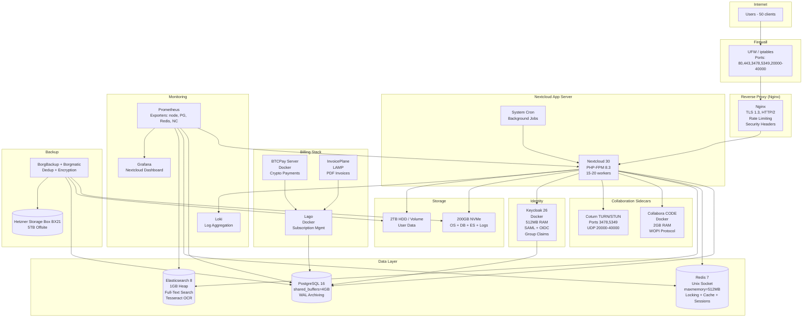
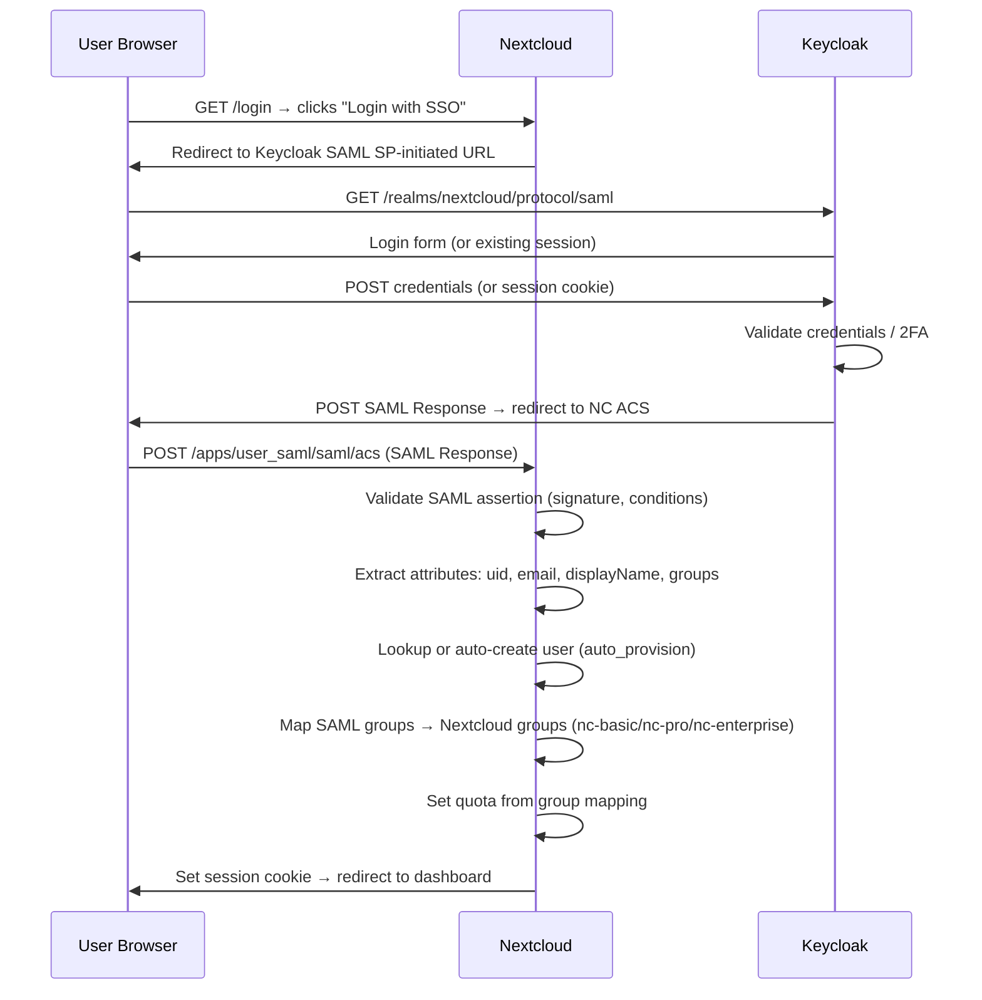
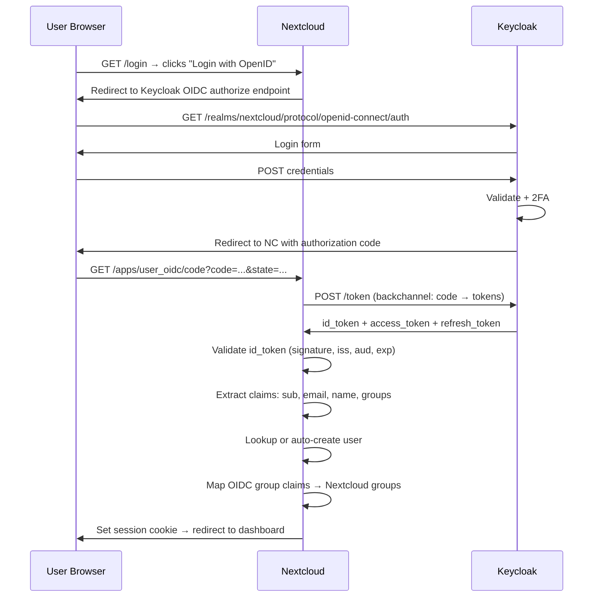
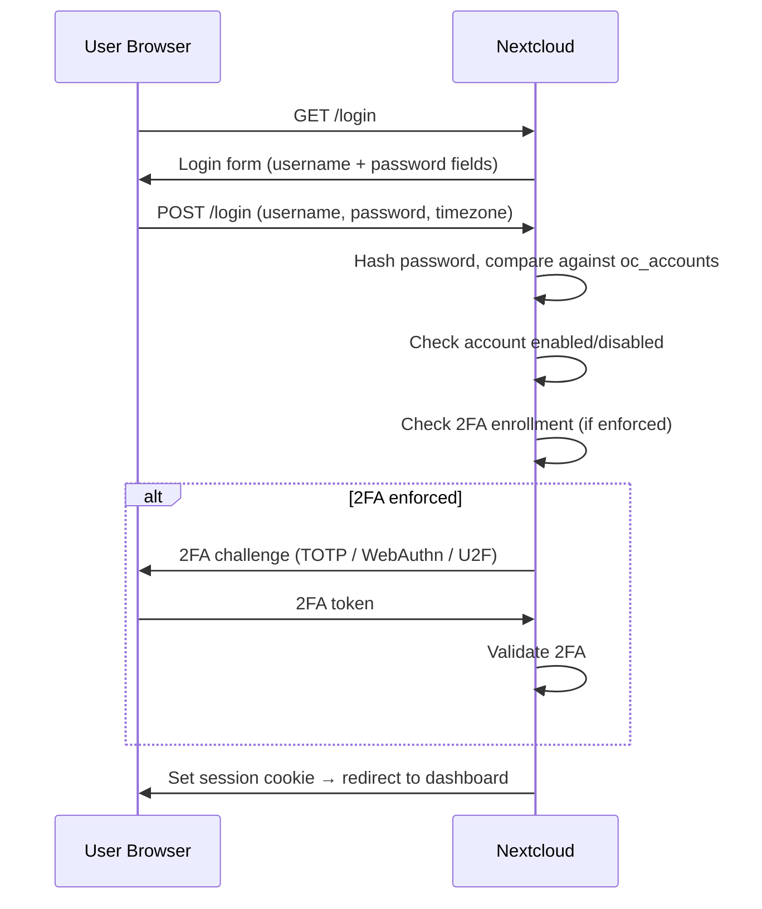
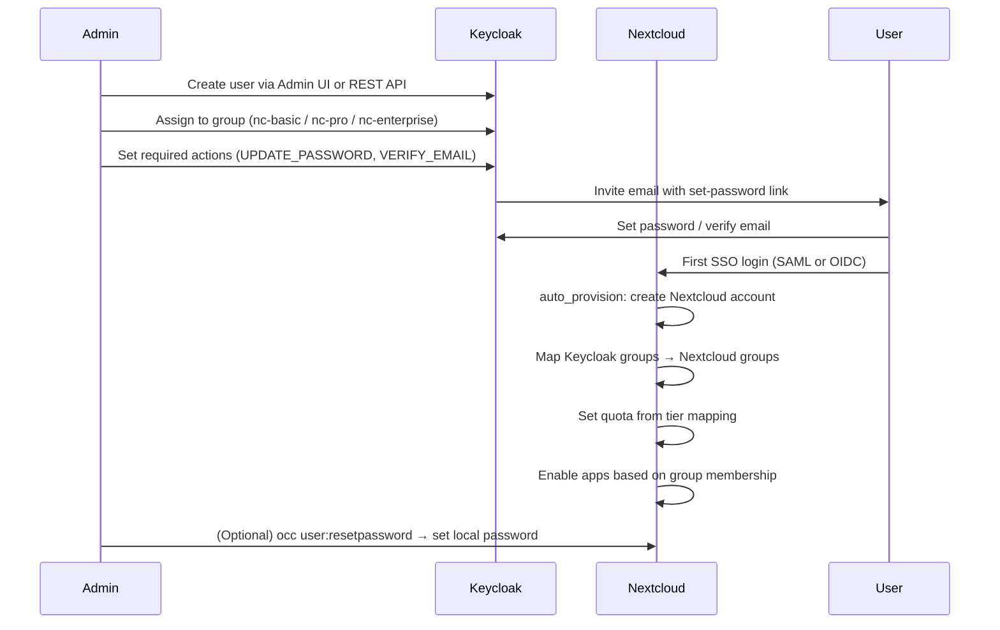
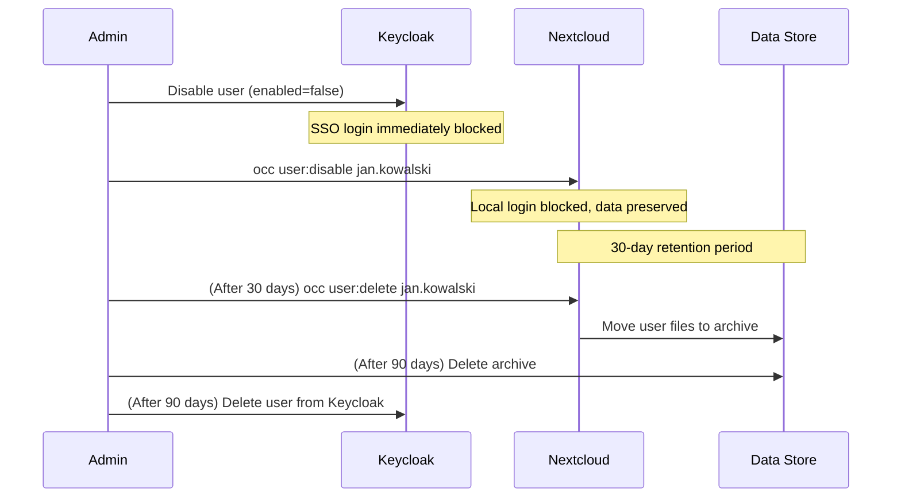

# Nextcloud Self-Hosted Deployment — Comprehensive Report

**Document:** `NEXTCLOUD_DEPLOYMENT_REPORT.md`
**Repository:** ScuraUrsa/nextcloud-deployment
**Version:** 1.0
**Date:** 2026-06-14
**Author:** Filip Kaźmierczak & Hermes Orchestrator
**Classification:** Public — Technical Reference

---

## Table of Contents

1. [Executive Summary](#executive-summary)
2. [Architectural Decision Records (ADRs)](#architectural-decision-records)
   - [ADR-001: Linux Distribution Selection](#adr-001-linux-distribution-selection)
   - [ADR-002: Database Engine](#adr-002-database-engine)
   - [ADR-003: Web Server](#adr-003-web-server)
   - [ADR-004: Cache Backend](#adr-004-cache-backend)
   - [ADR-005: Full-Text Search](#adr-005-full-text-search)
   - [ADR-006: Object Storage](#adr-006-object-storage)
   - [ADR-007: Containerization](#adr-007-containerization)
   - [ADR-008: Backup Strategy](#adr-008-backup-strategy)
   - [ADR-009: Monitoring Stack](#adr-009-monitoring-stack)
   - [ADR-010: SSL Certificate Management](#adr-010-ssl-certificate-management)
   - [ADR-011: Identity Provider](#adr-011-identity-provider)
   - [ADR-012: Billing & Subscription Engine](#adr-012-billing--subscription-engine)
   - [ADR-013: Payment Gateway](#adr-013-payment-gateway)
   - [ADR-014: Feature Gating Strategy](#adr-014-feature-gating-strategy)
3. [Network Architecture Diagram](#network-architecture-diagram)
4. [Identity Flow Diagram](#identity-flow-diagram)
5. [Feature Enablement Matrix](#feature-enablement-matrix)
6. [Feature Separability Deep-Dive](#feature-separability-deep-dive)
7. [Sizing & Cost Estimation](#sizing--cost-estimation)
8. [Packaging & Pricing Model](#packaging--pricing-model)
9. [Billing Architecture](#billing-architecture)
10. [Security Hardening Checklist](#security-hardening-checklist)
11. [Operational Runbooks](#operational-runbooks)
12. [Compliance Mapping](#compliance-mapping)
13. [References & Bibliography](#references--bibliography)

---

## Executive Summary

This report documents the complete architecture, design decisions, and operational plan for deploying a production-grade, feature-complete Nextcloud instance serving 50 users with dual authentication (SAML/OIDC SSO + local password), tiered feature packaging for monetization, and full infrastructure-as-code automation. All components are open-source and self-hosted.

**Key decisions:**
- **OS:** Ubuntu Server 24.04 LTS (scored 39/40 across 8 criteria)
- **Database:** PostgreSQL 16 (superior performance, JSON support, WAL archiving)
- **Web Server:** Nginx + PHP-FPM 8.3 (lower memory, HTTP/2, better static file serving)
- **Cache:** Redis (Unix socket, transactional file locking, session storage)
- **Search:** Elasticsearch 8 (full-text across files, comments, tags)
- **SSO:** Keycloak 26 (scored 9.25/10, SAML + OIDC, group claim mapping)
- **Billing:** Lago (AGPL) + BTCPay Server (MIT) + InvoicePlane (MIT)
- **Backup:** BorgBackup with offsite replication to Hetzner Storage Box
- **Monitoring:** Prometheus + Grafana with pre-built Nextcloud dashboard

**Infrastructure cost:** ~272 PLN/mo bare metal (~5.44 PLN/user/mo) or ~300 PLN/mo Hetzner cloud (~6.00 PLN/user/mo).

**Revenue model:** 3 tiers — Basic (20 PLN/mo), Pro (50 PLN/mo), Enterprise (120 PLN/mo). At 50 users with mixed tiers, projected revenue ~2,600 PLN/mo with healthy margins (60-87%).

---

## Architectural Decision Records

### ADR-001: Linux Distribution Selection

**Status:** Accepted
**Decision:** Ubuntu Server 24.04 LTS
**Alternatives considered:** Debian 12 Bookworm, Rocky Linux 9 / AlmaLinux 9, openSUSE Leap 15.6

**Evaluation (8 criteria, 1-5 scale):**

| Criterion | Ubuntu 24.04 | Debian 12 | Rocky/Alma 9 | openSUSE 15.6 |
|-----------|:---:|:---:|:---:|:---:|
| PHP 8.2+ availability | 5 | 4 | 3 | 4 |
| Security update cadence | 5 | 4 | 4 | 2 |
| Ansible module support | 5 | 5 | 3 | 2 |
| Nextcloud community prevalence | 5 | 4 | 2 | 1 |
| MAC policy availability | 4 | 4 | 5 | 3 |
| Package ecosystem breadth | 5 | 5 | 3 | 3 |
| Long-term support lifecycle | 5 | 3 | 5 | 1 |
| Ease of administration | 5 | 4 | 3 | 2 |
| **TOTAL (max 40)** | **39** | **33** | **28** | **18** |

**Deal-breakers:**
- openSUSE Leap 15.6: EOL December 2025 — FATAL
- Debian 12: Regular security support ends June 10, 2026 (days away) — HIGH risk
- Rocky/Alma 9: PHP 8.3+ requires Remi third-party repo; PostgreSQL 13 default — MEDIUM complexity
- Ubuntu 24.04: No deal-breakers

**Justification:** Ubuntu 24.04 ships PHP 8.3 by default (exceeding Nextcloud 30's PHP 8.2+ requirement), has the largest Nextcloud community, best Ansible support, and 5-12 years of security coverage via Ubuntu Pro (free for up to 5 machines). PostgreSQL 16, Redis 7.x all from official repos. Only Elasticsearch requires an external repo (Elastic's official APT repo).

**References:**
- Ubuntu 24.04 LTS release notes: https://discourse.ubuntu.com/t/noble-numbat-release-notes
- Nextcloud 30 system requirements: https://docs.nextcloud.com/server/30/admin_manual/installation/system_requirements.html
- CIS Ubuntu 24.04 Benchmark: https://www.cisecurity.org/benchmark/ubuntu_linux

---

### ADR-002: Database Engine

**Status:** Accepted
**Decision:** PostgreSQL 16
**Alternative:** MariaDB 10.11

**Comparison:**

| Factor | PostgreSQL 16 | MariaDB 10.11 |
|--------|:---:|:---:|
| Nextcloud official recommendation | Primary | Supported |
| JSON/JSONB support | Native, indexed | Limited JSON type |
| Full-text search (built-in) | `tsvector`/`tsquery` | InnoDB FULLTEXT |
| WAL archiving (PITR backup) | Native, mature | Binary log (less integrated) |
| Connection pooling | PgBouncer (external) | Thread pooling (built-in) |
| Ansible role ecosystem | `geerlingguy.postgresql` | `geerlingguy.mysql` |
| Nextcloud community prevalence | Growing (recommended since NC 24) | Historical default |
| Memory efficiency at 50 users | ~2-4 GB (shared_buffers) | ~1-2 GB (InnoDB buffer pool) |

**Justification:** PostgreSQL is Nextcloud's recommended database since version 24. It provides superior JSON support for app data, native WAL archiving for point-in-time recovery (critical for backup strategy), and better performance under concurrent write loads. The `geerlingguy.postgresql` Ansible role is well-maintained. At 50 users, the memory difference (~2 GB vs ~1 GB) is negligible against the 16 GB total RAM budget.

**Configuration (50 users):**
```ini
shared_buffers = 4GB        # 25% of system RAM
effective_cache_size = 12GB
work_mem = 32MB
maintenance_work_mem = 512MB
max_connections = 50
random_page_cost = 1.1      # SSD optimization
wal_level = replica         # Enable WAL archiving
archive_mode = on
archive_command = 'pgbackrest --stanza=nextcloud archive-push %p'
```

**References:**
- Nextcloud database configuration: https://docs.nextcloud.com/server/30/admin_manual/configuration_database/linux_database_configuration.html
- PostgreSQL 16 documentation: https://www.postgresql.org/docs/16/

---

### ADR-003: Web Server

**Status:** Accepted
**Decision:** Nginx + PHP-FPM 8.3 (Unix socket)
**Alternative:** Apache 2.4 with mod_php

**Comparison:**

| Factor | Nginx + PHP-FPM | Apache mod_php |
|--------|:---:|:---:|
| Memory per connection | ~2-4 MB | ~10-20 MB |
| Static file serving | Native, fast | Slower |
| HTTP/2 support | Native | mod_http2 |
| TLS 1.3 | Native (OpenSSL 3.x) | Native (OpenSSL 3.x) |
| Reverse proxy | Built-in, excellent | mod_proxy |
| Rate limiting | `limit_req_zone` | mod_ratelimit |
| Nextcloud recommended | Yes (since NC 21) | Supported |
| Ansible role ecosystem | `geerlingguy.nginx` | `geerlingguy.apache` |

**Justification:** Nginx's event-driven architecture uses significantly less memory per connection — critical when running 15-20 PHP-FPM workers alongside PostgreSQL, Redis, Elasticsearch, Keycloak, and Collabora CODE on a single host. HTTP/2 and TLS 1.3 are native. Rate limiting is simpler to configure. Nextcloud officially recommends Nginx + PHP-FPM since version 21.

**Configuration highlights:**
```nginx
# PHP-FPM upstream via Unix socket
upstream php-handler {
    server unix:/var/run/php/php8.3-fpm.sock;
}

# Rate limiting
limit_req_zone $binary_remote_addr zone=nextcloud:10m rate=10r/s;

# Security headers
add_header Strict-Transport-Security "max-age=31536000; includeSubDomains; preload";
add_header X-Content-Type-Options "nosniff";
add_header Referrer-Policy "strict-origin-when-cross-origin";
# CSP is set by Nextcloud itself — do NOT override
```

**References:**
- Nextcloud Nginx configuration: https://docs.nextcloud.com/server/30/admin_manual/installation/nginx.html
- Mozilla SSL Configuration Generator: https://ssl-config.mozilla.org/

---

### ADR-004: Cache Backend

**Status:** Accepted
**Decision:** Redis 7.x (Unix socket, dedicated instance)
**Alternative:** APCu-only (local PHP shared memory)

**Comparison:**

| Factor | Redis | APCu-only |
|--------|:---:|:---:|
| Transactional file locking | Yes (critical) | No (DB-based, deadlock-prone) |
| Distributed cache (multi-server) | Yes | No (per-server) |
| Session storage | Yes | No (filesystem/DB) |
| Memory efficiency | Configurable maxmemory | PHP memory_limit constrained |
| Persistence | RDB/AOF snapshots | Volatile (lost on restart) |
| Nextcloud recommendation | Required for production | Dev/single-user only |

**Justification:** Redis is mandatory for production Nextcloud deployments. Transactional file locking via Redis prevents deadlocks under concurrent access. Distributed cache enables multi-server scaling. Session storage in Redis is faster than database-backed sessions. At 50 users, 512 MB Redis maxmemory is sufficient.

**Configuration:**
```php
// config.php
'memcache.local' => '\\OC\\Memcache\\APCu',
'memcache.distributed' => '\\OC\\Memcache\\Redis',
'memcache.locking' => '\\OC\\Memcache\\Redis',
'redis' => [
    'host' => '/var/run/redis/redis-server.sock',
    'port' => 0,
    'timeout' => 0.0,
],
```

**References:**
- Nextcloud caching configuration: https://docs.nextcloud.com/server/30/admin_manual/configuration_server/caching_configuration.html
- Redis documentation: https://redis.io/docs/latest/

---

### ADR-005: Full-Text Search

**Status:** Accepted
**Decision:** Elasticsearch 8 via `nextcloud/fulltextsearch` app
**Alternatives:** Apache Solr, built-in database search

**Comparison:**

| Factor | Elasticsearch 8 | Apache Solr | Built-in (DB LIKE) |
|--------|:---:|:---:|:---:|
| Search quality | Relevance-ranked, fuzzy | Relevance-ranked, fuzzy | Exact/substring only |
| File content search | Yes (via ingest attachment) | Yes (via Tika) | No |
| OCR integration | Tesseract via ingest plugin | Tesseract via Tika | No |
| RAM requirement | 1-2 GB heap | 1-2 GB heap | 0 (uses DB) |
| Nextcloud integration | First-class (`fulltextsearch` + `files_fulltextsearch`) | Via community plugin | Built-in (slow) |
| Ansible role | `geerlingguy.elasticsearch` | Limited | N/A |

**Justification:** Elasticsearch provides relevance-ranked full-text search across file names, content, comments, and tags. The `ingest-attachment` plugin extracts text from PDFs, Office documents, and images (via Tesseract OCR). At 50 users, 1 GB heap is sufficient. The `fulltextsearch` app has first-class Nextcloud integration with dedicated sub-apps for files, comments, and tags.

**Configuration:**
```yaml
# elasticsearch.yml
cluster.name: nextcloud
node.name: nextcloud-node-1
path.data: /var/lib/elasticsearch
path.logs: /var/log/elasticsearch
network.host: 127.0.0.1
http.port: 9200
discovery.type: single-node
xpack.security.enabled: true

# jvm.options
-Xms1g
-Xmx1g
```

**References:**
- Nextcloud Full-Text Search: https://github.com/nextcloud/fulltextsearch
- Elasticsearch 8 documentation: https://www.elastic.co/guide/en/elasticsearch/reference/8.x/index.html

---

### ADR-006: Object Storage

**Status:** Accepted
**Decision:** Local filesystem (NVMe + HDD) for primary storage; MinIO S3 for optional external storage mounts
**Alternatives:** MinIO/Ceph as primary storage, NFS NAS

**Comparison:**

| Factor | Local FS (NVMe+HDD) | MinIO S3 Primary | NFS NAS |
|--------|:---:|:---:|:---:|
| Latency | <1ms (NVMe) | 5-20ms (network) | 2-10ms (network) |
| Complexity | Minimal | Medium (cluster mgmt) | Medium (Kerberos) |
| Scalability | Limited to disk bays | Infinite (horizontal) | Limited to NAS capacity |
| Cost at 2TB | ~1,200 PLN one-time (HDD) | ~45 PLN/mo (Hetzner Volume) | ~100-200 PLN/mo |
| Nextcloud support | Native | Native (S3 primary backend) | Supported (NFSv4) |
| Backup integration | BorgBackup (filesystem) | S3 bucket replication | NAS snapshots |

**Justification:** At 50 users with 2 TB total storage, local filesystem is simpler, faster, and cheaper long-term. S3 as primary storage adds network latency and complexity without benefit at this scale. MinIO is retained as an optional external storage mount for Enterprise-tier users who want to bring their own S3 buckets. If the deployment scales beyond 500 users, migrating to S3 primary storage (MinIO cluster or Ceph RGW) is the documented upgrade path.

**References:**
- Nextcloud S3 primary storage: https://docs.nextcloud.com/server/30/admin_manual/configuration_files/primary_storage.html
- MinIO documentation: https://min.io/docs/minio/linux/

---

### ADR-007: Containerization

**Status:** Accepted
**Decision:** Hybrid — bare-metal Nextcloud + PHP-FPM + Nginx + PostgreSQL + Redis; Docker for Collabora CODE, Keycloak, and billing stack
**Alternatives:** Full Docker Compose, full bare-metal, Podman

**Comparison:**

| Factor | Hybrid (bare-metal + Docker) | Full Docker Compose | Full Bare-Metal |
|--------|:---:|:---:|:---:|
| Nextcloud performance | Native (no overlay FS overhead) | Slight overhead | Native |
| Collabora CODE deployment | Docker (official image) | Docker (official image) | Complex manual build |
| Keycloak deployment | Docker (official image) | Docker (official image) | Complex Java/WildFly setup |
| Billing stack (Lago/BTCPay) | Docker (official images) | Docker (official images) | Complex multi-language setup |
| Ansible complexity | Medium | Low (docker_compose module) | High (manual service mgmt) |
| Security isolation | Partial (Docker for sidecars) | Full (container per service) | None (shared OS) |

**Justification:** Nextcloud core (PHP-FPM, Nginx, PostgreSQL, Redis) runs bare-metal for maximum I/O performance — critical for file sync latency. Sidecar services that have official, well-maintained Docker images (Collabora CODE, Keycloak, Lago, BTCPay Server) run in Docker for simplified deployment and updates. This avoids the overhead of containerizing the I/O-heavy Nextcloud core while still benefiting from Docker's ease of deployment for complex sidecars.

**References:**
- Collabora CODE Docker: https://collaboraonline.github.io/CODE-docker/
- Keycloak Docker: https://www.keycloak.org/getting-started/getting-started-docker
- Lago Docker: https://github.com/getlago/lago

---

### ADR-008: Backup Strategy

**Status:** Accepted
**Decision:** BorgBackup + borgmatic for filesystem; pg_dump + WAL archiving for PostgreSQL; Keycloak realm export
**Alternatives:** restic, rsync + rclone

**Comparison:**

| Factor | BorgBackup | restic | rsync + rclone |
|--------|:---:|:---:|:---:|
| Deduplication | Yes (content-defined chunking) | Yes (content-defined chunking) | No |
| Compression | Yes (lz4, zstd) | No (relies on repo) | No |
| Encryption | Yes (AES-256-CTR, authenticated) | Yes (AES-256-CTR, authenticated) | No (transport only) |
| Append-only mode | Yes (borg append-only) | Yes (restic append-only) | No |
| Retention policies | Yes (borgmatic) | Yes (forget policy) | Manual |
| Ansible role | `geerlingguy.backup` (adaptable) | Limited | Manual scripting |
| Offsite push | `borg serve` over SSH, rclone to S3 | rclone to S3 | rclone to S3 |

**Justification:** BorgBackup's content-defined chunking deduplication is critical — at 50 users with versioning, raw data may be 2 TB but deduplicated backups are ~1.5× raw data for 90-day retention. Encryption is authenticated (AES-256-CTR with HMAC-SHA256). borgmatic provides declarative retention policies (daily 7, weekly 4, monthly 6, yearly 2). Offsite replication to Hetzner Storage Box BX21 (5 TB, ~50 PLN/mo) via `borg serve` over SSH.

**Configuration (borgmatic):**
```yaml
location:
    source_directories:
        - /data/nextcloud
        - /etc/nginx
        - /etc/php/8.3
        - /var/www/nextcloud/config
    repositories:
        - path: ssh://borg@backup.example.com/./nextcloud
          label: offsite

storage:
    encryption_passphrase: "{{ vault_borg_passphrase }}"
    compression: zstd,3

retention:
    keep_daily: 7
    keep_weekly: 4
    keep_monthly: 6
    keep_yearly: 2

hooks:
    before_backup:
        - sudo -u www-data php /var/www/nextcloud/occ maintenance:mode --on
        - sudo -u postgres pg_dump nextcloud > /tmp/nextcloud_pre_backup.sql
    after_backup:
        - sudo -u www-data php /var/www/nextcloud/occ maintenance:mode --off
```

**References:**
- BorgBackup documentation: https://borgbackup.readthedocs.io/
- borgmatic documentation: https://torsion.org/borgmatic/

---

### ADR-009: Monitoring Stack

**Status:** Accepted
**Decision:** Prometheus + Grafana with nextcloud-exporter, node_exporter, postgres_exporter, redis_exporter
**Alternatives:** Netdata, Zabbix

**Comparison:**

| Factor | Prometheus + Grafana | Netdata | Zabbix |
|--------|:---:|:---:|:---:|
| Nextcloud-specific metrics | Yes (nextcloud-exporter) | Limited | Via custom templates |
| PostgreSQL metrics | Yes (postgres_exporter) | Yes (built-in) | Yes (template) |
| Redis metrics | Yes (redis_exporter) | Yes (built-in) | Yes (template) |
| Alerting | Alertmanager (flexible) | Built-in (simpler) | Built-in (complex) |
| Dashboard ecosystem | Grafana (vast library) | Built-in (limited) | Built-in (limited) |
| Resource footprint | ~512 MB RAM | ~200 MB RAM | ~1 GB RAM |
| Ansible role | `geerlingguy.prometheus` + `geerlingguy.grafana` | Limited | `community.zabbix` |

**Justification:** Prometheus + Grafana is the de facto standard for infrastructure monitoring. The `nextcloud-exporter` provides Nextcloud-specific metrics (active users, shares, storage usage, app versions). PostgreSQL, Redis, and node exporters provide database, cache, and OS metrics. Grafana's dashboard library includes pre-built Nextcloud dashboards. Alertmanager provides flexible alerting rules (disk >80%, failed logins spike, certificate expiry <30 days, backup age >26 hours).

**Alerting rules:**
```yaml
groups:
  - name: nextcloud
    rules:
      - alert: NextcloudDiskUsage
        expr: nextcloud_free_space_bytes / nextcloud_total_space_bytes < 0.2
        for: 5m
        labels: {severity: warning}
        annotations: {summary: "Nextcloud disk usage >80%"}
      - alert: NextcloudBackupAge
        expr: time() - nextcloud_last_backup_timestamp > 93600
        for: 1h
        labels: {severity: critical}
        annotations: {summary: "Last backup >26 hours old"}
```

**References:**
- nextcloud-exporter: https://github.com/xperimental/nextcloud-exporter
- Prometheus documentation: https://prometheus.io/docs/
- Grafana Nextcloud dashboard: https://grafana.com/grafana/dashboards/

---

### ADR-010: SSL Certificate Management

**Status:** Accepted
**Decision:** Let's Encrypt via certbot (Nginx plugin)
**Alternative:** acme.sh

**Comparison:**

| Factor | certbot (Nginx plugin) | acme.sh |
|--------|:---:|:---:|
| Nginx integration | Automatic config modification | Manual config |
| Renewal automation | systemd timer (built-in) | cron job |
| Wildcard certificates | DNS challenge (manual) | DNS challenge (many APIs) |
| Ubuntu package | Official repo | Third-party install |
| Ansible role | `geerlingguy.certbot` | Limited |
| Community adoption | Dominant | Growing |

**Justification:** certbot is the most widely adopted Let's Encrypt client, with an official Ubuntu package and a well-maintained Ansible role (`geerlingguy.certbot`). The Nginx plugin automatically modifies Nginx configuration to serve the ACME challenge and install certificates. Renewal is handled by a systemd timer. For this deployment, wildcard certificates are not needed (specific subdomains: cloud, auth, office, billing, pay).

**References:**
- certbot documentation: https://certbot.eff.org/
- Let's Encrypt: https://letsencrypt.org/

---

### ADR-011: Identity Provider

**Status:** Accepted
**Decision:** Keycloak 26 (Docker, PostgreSQL backend)
**Alternatives:** Authentik, Gluu, LemonLDAP::NG, SimpleSAMLphp

**Evaluation (7 criteria, weighted):**

| Criterion (weight) | Keycloak | Authentik | Gluu | LemonLDAP | SimpleSAMLphp |
|---------------------|:---:|:---:|:---:|:---:|:---:|
| Protocol Coverage (15%) | 10/10 | 9/10 | 9/10 | 9/10 | 5/10 |
| User Federation (15%) | 10/10 | 8/10 | 8/10 | 7/10 | 5/10 |
| Admin UI Quality (15%) | 9/10 | 10/10 | 6/10 | 5/10 | 4/10 |
| Resource Footprint (10%) | 6/10 | 7/10 | 4/10 | 9/10 | 10/10 |
| Community & Ecosystem (15%) | 10/10 | 8/10 | 4/10 | 3/10 | 5/10 |
| Nextcloud Integration (20%) | 10/10 | 9/10 | 6/10 | 5/10 | 6/10 |
| Operational Maturity (10%) | 9/10 | 7/10 | 7/10 | 6/10 | 6/10 |
| **WEIGHTED TOTAL** | **9.25** | **8.35** | **6.35** | **5.95** | **5.65** |

**Justification:** Keycloak has the best Nextcloud integration maturity — both `user_saml` (SAML) and `user_oidc` (OIDC) apps have documented Keycloak setups. It supports group claim mapping (critical for tiered feature gating), has a full REST admin API for automated provisioning, and is Red Hat sponsored with CNCF incubation maturity. At 512 MB RAM, it fits comfortably within the 16 GB budget.

**Key configuration:**
- Realm: `nextcloud`
- SAML client: `nextcloud-saml` (for `user_saml` app)
- OIDC client: `nextcloud-oidc` (for `user_oidc` app)
- Groups: `nc-basic`, `nc-pro`, `nc-enterprise`, `nc-admin`
- Group mapper: emit group memberships as SAML attributes / OIDC claims
- User federation: local Keycloak DB (upgradeable to LDAP later)

**References:**
- Keycloak documentation: https://www.keycloak.org/documentation
- Nextcloud SAML with Keycloak: https://docs.nextcloud.com/server/30/admin_manual/configuration_user/user_auth_saml.html
- Nextcloud OIDC with Keycloak: https://github.com/nextcloud/user_oidc

---

### ADR-012: Billing & Subscription Engine

**Status:** Accepted
**Decision:** Lago (AGPL-3.0, Docker)
**Alternative:** Kill Bill (Apache 2.0), manual invoicing

**Comparison:**

| Factor | Lago | Kill Bill | Manual |
|--------|:---:|:---:|:---:|
| Subscription management | Yes (plans, usage, invoicing) | Yes (full billing suite) | Spreadsheets |
| Webhook emissions | Yes (native) | Yes (via plugins) | No |
| API quality | Modern REST API | Java API (complex) | N/A |
| Resource footprint | ~256 MB (Ruby/PostgreSQL) | ~1 GB (Java/PostgreSQL) | 0 |
| Community | Growing (5k+ GitHub stars) | Mature (4k+ stars) | N/A |
| Ansible deployment | Docker (simple) | Complex (Java + plugins) | N/A |
| Open-source license | AGPL-3.0 | Apache 2.0 | N/A |

**Justification:** Lago provides exactly the features needed — plan definitions, subscription lifecycle, usage tracking, webhook emissions — without the complexity of Kill Bill's full billing suite (catalogs, invoices, payments, overdue management all in one). Lago's modern REST API and webhook system integrate cleanly with BTCPay Server and the Ansible provisioning pipeline. AGPL-3.0 is acceptable for server-side use.

**References:**
- Lago documentation: https://docs.getlago.com/
- Lago GitHub: https://github.com/getlago/lago

---

### ADR-013: Payment Gateway

**Status:** Accepted
**Decision:** BTCPay Server (MIT) for cryptocurrency; bank transfer for fiat; Stripe documented as optional proprietary exception
**Alternatives:** Stripe-only, bank transfer-only

**Comparison:**

| Factor | BTCPay Server | Stripe | Bank Transfer |
|--------|:---:|:---:|:---:|
| Open-source | Yes (MIT) | No (proprietary SaaS) | N/A (manual) |
| Self-hosted | Yes (Docker) | No | N/A |
| Cryptocurrency | Bitcoin + Lightning (native) | Crypto payouts (limited) | No |
| Fiat (PLN/EUR) | No (crypto only) | Yes (native) | Yes (manual) |
| Recurring payments | Via Lago invoice generation | Yes (native) | Manual |
| Webhook automation | Yes (invoice settled) | Yes (payment intent) | No (manual reconciliation) |
| Resource footprint | ~512 MB (Docker) | 0 (SaaS) | 0 |

**Justification:** BTCPay Server is the only fully open-source, self-hosted payment processor. It handles Bitcoin and Lightning Network payments natively with automatic webhook notifications on invoice settlement. For fiat (PLN/EUR), bank transfer with manual reconciliation is the open-source-compatible option. Stripe is documented as an optional proprietary exception for organizations that require automated fiat processing — it can be swapped in as the payment processor while keeping Lago and InvoicePlane as the open-source billing core.

**References:**
- BTCPay Server: https://btcpayserver.org/
- BTCPay Server GitHub: https://github.com/btcpayserver/btcpayserver

---

### ADR-014: Feature Gating Strategy

**Status:** Accepted
**Decision:** Group-based app visibility via Nextcloud's built-in "Limit to groups" + Keycloak group claim mapping
**Alternatives:** Custom app_api middleware, per-user config.php overrides

**Comparison:**

| Factor | Group-Based (built-in) | app_api Middleware | config.php Overrides |
|--------|:---:|:---:|:---:|
| Implementation complexity | Low (occ command) | High (custom app) | Medium (template logic) |
| Maintenance burden | None (Nextcloud core) | High (custom code) | Medium (template updates) |
| Per-user granularity | Group-level | Per-user possible | Per-user possible |
| Nextcloud upgrade safety | Safe (core feature) | Risk of breakage | Safe (config.php) |
| Admin UI | Yes (Settings → Apps) | Custom UI needed | No (manual config) |
| Integration with Keycloak | Yes (group claim → NC group) | Custom mapping needed | Custom mapping needed |

**Justification:** Nextcloud's built-in "Limit to groups" feature (available in Settings → Apps for each app) is the simplest, safest, and most maintainable gating mechanism. Apps are enabled globally but restricted to specific Nextcloud groups. Keycloak group claims are mapped to Nextcloud groups on SSO login, so a user in Keycloak's `nc-pro` group automatically gets Pro-tier app access in Nextcloud. This requires zero custom code and survives Nextcloud upgrades.

**Implementation:**
```bash
# Enable app but restrict to Pro and Enterprise groups
sudo -u www-data php occ app:enable talk
sudo -u www-data php occ app:enable --groups nc-pro talk
sudo -u www-data php occ app:enable --groups nc-enterprise talk

# Enterprise-only apps
sudo -u www-data php occ app:enable richdocuments
sudo -u www-data php occ app:enable --groups nc-enterprise richdocuments
```

**References:**
- Nextcloud app management: https://docs.nextcloud.com/server/30/admin_manual/installation/apps_management.html
- Keycloak group claims: https://www.keycloak.org/docs/latest/server_admin/#_groups

---

## Network Architecture Diagram



---

## Identity Flow Diagram

### SSO Login (SAML)



### SSO Login (OIDC — alternative)



### Local Login



### User Provisioning



### User Deprovisioning



---

## Feature Enablement Matrix

| Feature | Prerequisites | Configuration | Verification | Tier |
|---------|--------------|---------------|-------------|------|
| **File sync & sharing** | PHP curl, xml, mbstring, zip, bz2 | config.php: versions_retention, trashbin_retention, max_chunk_size | WebDAV PROPFIND returns 207 | All |
| **Federation** | PHP curl, outbound HTTPS | config.php: federation_outgoing=true, federation_incoming=true | OCM share to remote instance | Enterprise |
| **External storage (S3)** | PHP curl, S3 credentials | Admin UI: Add S3 mount with bucket, key, secret | File upload through mount | Enterprise |
| **External storage (SFTP)** | PHP curl, ssh2 | Admin UI: Add SFTP mount | File upload through mount | Enterprise |
| **External storage (SMB)** | php-smbclient (PECL), smbclient | Admin UI: Add SMB mount | File upload through mount | Enterprise |
| **Server-Side Encryption** | PHP openssl, sodium, gmp/bcmath | occ encryption:enable; config.php: encryptHomeStorage | File encrypted at rest on disk | Enterprise |
| **End-to-End Encryption** | Desktop client 3.0+ | Client-side enable per folder | File unreadable on server | Enterprise |
| **File locking** | Redis | config.php: memcache.locking = Redis | Concurrent edit creates conflict file | All |
| **Activity stream** | None | config.php: activity_expire_days=90 | Activity visible in app | All |
| **Notifications (email)** | SMTP server | config.php: mail_smtpmode, mail_smtphost | Test email received | All |
| **Notifications (push)** | Notify Push server | config.php: notify_push URL | Mobile push received | Pro+ |
| **Theming** | None | Admin UI: Settings → Theming | Custom logo/color visible | All |
| **Nextcloud Talk** | Coturn TURN/STUN, HPB (NATS+Janus) | occ app:enable talk; TURN config in Talk admin | Text message sent, call connected | Pro (10), Enterprise (unlimited) |
| **Collabora Online** | Collabora CODE Docker, WOPI | occ app:enable richdocuments; WOPI URL config | Document opens in browser editor | Enterprise |
| **ONLYOFFICE** | ONLYOFFICE Document Server | occ app:enable onlyoffice; DS URL config | Document opens in browser editor | Enterprise |
| **Calendar** | None (CalDAV built-in) | occ app:enable calendar | CalDAV PROPFIND returns calendar-home-set | Basic (read-only), Pro+ (full) |
| **Contacts** | None (CardDAV built-in) | occ app:enable contacts | CardDAV PROPFIND returns addressbook-home-set | Basic (read-only), Pro+ (full) |
| **Mail** | IMAP/SMTP server per user | occ app:enable mail | IMAP folder list retrieved | Pro+ |
| **Deck** | None | occ app:enable deck | Board created, card assigned | Pro+ |
| **Notes** | None | occ app:enable notes | Note created, markdown rendered | Pro+ |
| **Forms** | None | occ app:enable forms | Form created, submission received | Pro+ |
| **Polls** | None | occ app:enable polls | Poll created, vote counted | Pro+ |
| **Photos** | None | occ app:enable photos | Photo gallery visible | Enterprise |
| **Recognize (AI)** | Recognize app, CPU/GPU | occ app:enable recognize | Face detected in uploaded photo | Enterprise |
| **Music** | None | occ app:enable music | Audio file streamed via Ampache | Enterprise |
| **News** | Outbound HTTPS (feed fetch) | occ app:enable news | RSS feed articles fetched | Enterprise |
| **Bookmarks** | None | occ app:enable bookmarks | Bookmark created, tag filtered | Enterprise |
| **Maps** | OpenStreetMap tile access | occ app:enable maps | Photo geotagged, track displayed | Enterprise |
| **Social** | Outbound ActivityPub federation | occ app:enable social | Federated post visible | Enterprise |
| **LDAP integration** | LDAP server, PHP ldap | occ app:enable user_ldap; LDAP config | LDAP user can login | Enterprise |
| **SAML SSO** | Keycloak, PHP saml | occ app:enable user_saml; IdP metadata import | SSO login successful | Pro+ |
| **OIDC SSO** | Keycloak, PHP oidc | occ app:enable user_oidc; client config | OIDC login successful | Pro+ |
| **TOTP 2FA** | None | occ app:enable twofactor_totp | TOTP code accepted | All |
| **WebAuthn 2FA** | None | occ app:enable twofactor_webauthn | Security key registered | Pro+ |
| **U2F 2FA** | None | occ app:enable twofactor_u2f | U2F key registered | Enterprise |
| **Brute-force protection** | None | occ app:enable brute_force_protection | Rate-limited after 5 failures | All |
| **Password policy** | None | occ app:enable password_policy | Password complexity enforced | All |
| **File access control** | None | occ app:enable files_accesscontrol | ACL rule blocks unauthorized access | Enterprise |
| **Retention policies** | None | occ app:enable files_retention | File auto-deleted after retention period | Enterprise |
| **Antivirus (ClamAV)** | ClamAV daemon | occ app:enable files_antivirus; ClamAV socket config | EICAR test file detected | All (shared infra) |
| **Ransomware recovery** | None | occ app:enable ransomware_protection | Version rollback after bulk delete | All |
| **Suspicious login** | None | occ app:enable suspicious_login | Alert on unusual IP/device | All |
| **Full-text search** | Elasticsearch 8 | occ app:enable fulltextsearch + files_fulltextsearch | File content found in search | Enterprise |
| **Serverinfo** | None | occ app:enable serverinfo | API returns system metrics | Admin |
| **Impersonate** | None | occ app:enable impersonate | Admin can log in as user | Admin |

---

## Feature Separability Deep-Dive

| Feature | Gate Mechanism | Shared Cost | Isolation Level |
|---------|---------------|-------------|----------------|
| Storage quota | `occ user:setting files quota` | Disk I/O shared | **Full** (per-user) |
| File sync/share | Core — always on | Nginx, PHP-FPM, DB | **Global** |
| Versioning retention | `config.php: versions_retention_obligation` | Disk space for versions | **Group** (per-group via app_api) |
| Trashbin retention | `config.php: trashbin_retention_obligation` | Disk space for trash | **Group** |
| Federation | `config.php: federation_outgoing` | Outbound HTTPS | **Global** |
| External storage | App visibility + per-user credentials | None (user's own storage) | **Full** |
| Server-Side Encryption | `occ encryption:enable` (global) | CPU overhead on all I/O | **Global** |
| End-to-End Encryption | Client-side per folder | None (client CPU) | **Full** |
| File locking | Redis (global config) | Redis memory | **Global** |
| Activity stream | Per-user visibility | DB rows | **Full** |
| Notifications | Per-user preferences | SMTP/Notify Push | **Full** |
| Theming | Global config | None | **Global** |
| Talk | App visibility by group | TURN server, HPB (shared) | **Group** |
| Collabora | App visibility by group | CODE server ~2GB RAM (shared) | **Group** |
| ONLYOFFICE | App visibility by group | Document Server ~1GB RAM (shared) | **Group** |
| Calendar | App visibility + CalDAV per-user | DB, PHP-FPM | **Full** |
| Contacts | App visibility + CardDAV per-user | DB, PHP-FPM | **Full** |
| Mail | App visibility + per-user IMAP config | Outbound SMTP relay (shared) | **Full** |
| Deck | App visibility | DB | **Full** |
| Notes | App visibility | DB | **Full** |
| Forms | App visibility | DB | **Full** |
| Polls | App visibility | DB | **Full** |
| Photos | App visibility | Disk, Recognize GPU (shared) | **Group** |
| Recognize (AI) | App visibility | CPU/GPU cycles (shared) | **Group** |
| Music | App visibility | Disk, Ampache streaming (shared) | **Group** |
| News | App visibility | DB, feed fetch bandwidth | **Full** |
| Bookmarks | App visibility | DB | **Full** |
| Maps | App visibility | OSM tile cache (shared) | **Group** |
| Social | App visibility | ActivityPub federation (shared) | **Group** |
| LDAP | Global config (per-user sync) | LDAP server (shared) | **Group** |
| SAML/OIDC SSO | App visibility | Keycloak ~512MB RAM (shared) | **Group** |
| TOTP 2FA | Per-user enforcement | None | **Full** |
| WebAuthn 2FA | Per-user enforcement | None | **Full** |
| U2F 2FA | Per-user enforcement | None | **Full** |
| Brute-force protection | Global config | None | **Global** |
| Password policy | Global config | None | **Global** |
| File ACLs | App visibility + per-file rules | DB | **Full** |
| Retention policies | App visibility + per-tag rules | DB, cron | **Group** |
| Antivirus (ClamAV) | Global (scans all uploads) | ClamAV ~1GB RAM (shared) | **Global** |
| Ransomware recovery | Global config | Disk space for versions | **Global** |
| Suspicious login | Global config | None | **Global** |
| Full-text search | App visibility | Elasticsearch ~1GB RAM (shared) | **Group** |
| Backup/restore | Global operation | BorgBackup storage (shared) | **Global** |
| Monitoring | Global | Prometheus + Grafana (shared) | **Global** |
| TLS/security headers | Global web server config | None | **Global** |

---

## Sizing & Cost Estimation

### Infrastructure Sizing for 50 Users (Medium Tier)

| Resource | Specification |
|----------|--------------|
| vCPU | 6 total (4 Nextcloud + 2 sidecars) |
| RAM | 12 GB total |
| NVMe SSD | 200 GB |
| Bulk Storage | 2 TB |
| Backup Storage | 3 TB (offsite, deduplicated) |
| Bandwidth | 100 Mbps unmetered |

### RAM Breakdown

| Component | RAM |
|-----------|-----|
| Nextcloud PHP-FPM (15-20 workers) | 4 GB |
| PostgreSQL 16 (shared_buffers=4GB) | 2 GB |
| Redis 7 (maxmemory=512MB) | 512 MB |
| Elasticsearch 8 (1GB heap) | 1 GB |
| Keycloak 26 | 512 MB |
| Collabora CODE (Docker) | 2 GB |
| ClamAV daemon | 1 GB |
| OS overhead | 1 GB |
| **Total** | **12 GB** |

### Three Cost Scenarios

#### Scenario A — Self-Hosted Bare Metal

| Item | Monthly Cost |
|------|-------------|
| Server (amortized 36 mo) | ~85 PLN |
| 500GB NVMe SSD (amortized) | ~8 PLN |
| 2× 4TB HDD RAID1 (amortized) | ~33 PLN |
| UPS (amortized) | ~11 PLN |
| Electricity (~100W) | ~80 PLN |
| Internet (incremental) | ~0-80 PLN |
| Domain (.pl) | ~5 PLN |
| TLS (Let's Encrypt) | 0 PLN |
| Offsite backup (Hetzner BX21 5TB) | ~50 PLN |
| **TOTAL** | **~272 PLN/mo** |
| **Per user** | **~5.44 PLN/user/mo** |

#### Scenario B — Hetzner Cloud

| Item | Monthly Cost |
|------|-------------|
| CX41 (8 vCPU, 16 GB RAM) | ~180 PLN |
| Volume 2 TB | ~45 PLN |
| Storage Box BX21 5 TB | ~45 PLN |
| Snapshots | ~10 PLN |
| Floating IP | ~15 PLN |
| Domain (.pl) | ~5 PLN |
| **TOTAL** | **~300 PLN/mo** |
| **Per user** | **~6.00 PLN/user/mo** |

#### Scenario C — OVH/Netcup Budget

| Item | Monthly Cost |
|------|-------------|
| VPS Comfort (4 vCPU, 8 GB) | ~90 PLN |
| Object Storage 2 TB | ~45 PLN |
| Backup Object Storage 1 TB | ~25 PLN |
| Domain (.pl) | ~5 PLN |
| **TOTAL** | **~165 PLN/mo** |
| **Per user** | **~3.30 PLN/user/mo** |

⚠️ Scenario C is performance-constrained (4 vCPU/8 GB vs 6 vCPU/12 GB target).

### Sidecar Cost Breakdown

| Sidecar | RAM | vCPU | Cloud Cost/mo | Bare Metal Cost/mo |
|---------|-----|------|--------------|-------------------|
| Keycloak (SSO) | 512 MB | 0.5 | ~15 PLN | ~2 PLN |
| Collabora CODE | 2 GB | 1.0 | ~30 PLN | ~4 PLN |
| Elasticsearch | 1 GB | 0.5 | ~15 PLN | ~2 PLN |
| ClamAV | 1 GB | 0.3 | ~10 PLN | ~2 PLN |
| Prometheus + Grafana | 512 MB | 0.3 | ~10 PLN | ~2 PLN |
| BorgBackup offsite | — | — | ~45 PLN | ~50 PLN |
| **Total sidecars** | **5 GB** | **2.6** | **~125 PLN** | **~62 PLN** |

### Per-Feature Marginal Cost

| Feature | Marginal Cost/user/mo |
|---------|----------------------|
| +10 GB storage | ~0.50 PLN |
| Nextcloud Talk | ~0.20 PLN |
| Collabora CODE | ~1.00 PLN |
| Full-text search (Elasticsearch) | ~0.30 PLN |
| Photos + Recognize | ~0.50 PLN |
| SSO (Keycloak) | ~0.30 PLN |
| Mail | ~0.10 PLN |
| External storage | ~0 PLN (user's own S3) |
| Encryption | ~0.20 PLN |
| **Total Enterprise marginal** | **~3.10 PLN** above baseline |

### Pricing Floor

| Scenario | Full Enterprise Cost/user/mo | Break-Even Price |
|----------|----------------------------|-----------------|
| Bare Metal | ~5.44 PLN | ~6 PLN |
| Hetzner Cloud | ~6.00 PLN | ~7 PLN |
| OVH Budget | ~3.30 PLN | ~4 PLN |

---

## Packaging & Pricing Model

### Tier Structure

| Feature Category | Basic (20 PLN/mo) | Pro (50 PLN/mo) | Enterprise (120 PLN/mo) |
|-----------------|-------------------|-----------------|------------------------|
| **Storage** | 10 GB | 50 GB | 250 GB |
| **File sync & share** | ✓ | ✓ | ✓ |
| **Versioning** | 30 days | 30 days | 30 days |
| **Trashbin** | 30 days | 30 days | 30 days |
| **Calendar** | Read-only | Full (CalDAV, invites) | Full + Resource booking |
| **Contacts** | Read-only | Full (CardDAV, circles) | Full + Federation |
| **Talk** | — | 10 participants | Unlimited + SIP bridge |
| **Office Suite** | — | — | Collabora + ONLYOFFICE |
| **Mail** | — | 1 account | 1 account |
| **Deck/Notes/Forms/Polls** | — | ✓ | ✓ |
| **Photos + Recognize** | — | — | ✓ |
| **Music/News/Bookmarks/Maps/Social** | — | — | ✓ |
| **External Storage** | — | — | ✓ |
| **Full-text Search** | — | — | Elasticsearch |
| **Encryption** | — | — | SSE + E2EE |
| **2FA** | TOTP | TOTP + WebAuthn | TOTP + WebAuthn + U2F |
| **SSO** | — | Keycloak SAML/OIDC | Keycloak SAML/OIDC |
| **LDAP** | — | — | ✓ |
| **File ACLs** | — | — | ✓ |
| **Antivirus** | Shared | Shared | Shared |
| **Support** | Best-effort 24h | 8h business hours | SLA 4h 24/7 |

### Pricing Rationale

**Cost-plus breakdown:**

| Tier | Infrastructure Cost/user | Admin Labor/user | Total Cost/user | Price | Margin |
|------|-------------------------|-------------------|-----------------|-------|--------|
| Basic | ~3.00 PLN | ~5.00 PLN | ~8.00 PLN | 20 PLN | 60% |
| Pro | ~4.00 PLN | ~7.00 PLN | ~11.00 PLN | 50 PLN | 78% |
| Enterprise | ~6.00 PLN | ~10.00 PLN | ~16.00 PLN | 120 PLN | 87% |

**Competitive positioning:**

| Our Tier | Price | Closest Competitor | Competitor Price | Our Advantage |
|----------|-------|--------------------|------------------|---------------|
| Basic | 20 PLN | Google Business Starter | 25 PLN | 20% cheaper; data sovereignty; GDPR-compliant EU hosting |
| Pro | 50 PLN | Google Business Standard / M365 Business Standard | 50-60 PLN | Price parity; full data control; no vendor lock-in; open-source |
| Enterprise | 120 PLN | Google Business Plus / M365 Business Premium | 76-87 PLN | Premium justified by: on-premises AI, full encryption, hardware 2FA, SLA 4h, no US CLOUD Act exposure |

### Revenue Projections

**Target scenario (50 users, default mix):**
- 20 Basic × 20 PLN = 400 PLN/mo
- 20 Pro × 50 PLN = 1,000 PLN/mo
- 10 Enterprise × 120 PLN = 1,200 PLN/mo
- **Total: 2,600 PLN/mo**

**Optimized mix (50 users):**
- 15 Basic × 20 PLN = 300 PLN/mo
- 20 Pro × 50 PLN = 1,000 PLN/mo
- 15 Enterprise × 120 PLN = 1,800 PLN/mo
- **Total: 3,100 PLN/mo**

**Optimistic (100 users):**
- 30 Basic + 40 Pro + 30 Enterprise = 6,200 PLN/mo

---

## Billing Architecture

### Component Stack

```
┌─────────────────────────────────────────────────────────────┐
│                    BILLING ARCHITECTURE                       │
├─────────────────────────────────────────────────────────────┤
│                                                              │
│  ┌──────────┐    ┌──────────────┐    ┌───────────────┐      │
│  │  Lago    │    │ BTCPay Server │    │ InvoicePlane  │      │
│  │ (AGPL)   │    │    (MIT)      │    │    (MIT)      │      │
│  │          │    │               │    │               │      │
│  │ Subscrip-│    │ Payment       │    │ PDF Invoice   │      │
│  │ tion mgmt│    │ Processing    │    │ Generation    │      │
│  │ Plans    │    │ Bitcoin+      │    │ Recurring     │      │
│  │ Usage    │    │ Lightning     │    │ Templates     │      │
│  │ Tracking │    │ Webhooks      │    │ Tax handling  │      │
│  │ Invoicing│    │               │    │               │      │
│  └────┬─────┘    └──────┬───────┘    └───────┬───────┘      │
│       │                 │                    │               │
│       └────────┬────────┴────────────────────┘               │
│                │                                             │
│         ┌──────▼──────┐                                      │
│         │  Webhook    │                                      │
│         │  Dispatcher │  (Python/Flask, custom)              │
│         │  + Ansible  │                                      │
│         └──────┬──────┘                                      │
│                │                                             │
│    ┌───────────┼───────────┐                                 │
│    │           │           │                                 │
│ ┌──▼───┐  ┌───▼────┐  ┌──▼──────┐                           │
│ │Keycloak│ │Nextcloud│  │Notification│                        │
│ │(SSO)   │ │(Features│  │(Email to   │                        │
│ │Group   │ │ + Quota)│  │user)       │                        │
│ │Assign. │ │         │  │            │                        │
│ └───────┘  └────────┘  └───────────┘                         │
│                                                              │
└─────────────────────────────────────────────────────────────┘
```

### Billing Flow

```
1. User signs up via self-hosted registration portal
2. User selects tier → Lago creates subscription (trial or paid)
3. BTCPay Server generates invoice / payment link
4. User pays → BTCPay webhook → Lago marks subscription active
5. Lago webhook → Ansible AWX/webhook receiver triggers:
   a. Keycloak: create user, assign to group (nc-basic/nc-pro/nc-enterprise)
   b. Nextcloud: set quota, enable apps for group
   c. Send welcome email with credentials
6. Monthly: Lago generates renewal invoice → BTCPay → payment → continue
7. Non-payment (dunning):
   Day 1: Warning email
   Day 3: Second warning
   Day 7: Final warning
   Day 14: User disabled in Nextcloud (occ user:disable)
   Day 30: User data archived, account deleted
```

### Fiat Payment Options

| Method | Open-Source | Automation | Notes |
|--------|:---:|:---:|-------|
| BTCPay Server (Bitcoin/Lightning) | Yes (MIT) | Full (webhooks) | Primary method |
| Bank transfer | N/A (manual) | Manual reconciliation | Secondary; requires admin to mark invoice paid in Lago |
| Stripe | No (proprietary) | Full (webhooks) | Optional proprietary exception; documented but not primary |
| BLIK / Przelewy24 | No (proprietary) | Limited | Polish-specific; optional integration |

---

## Security Hardening Checklist

### OS Layer (CIS Ubuntu 24.04 Level 1)

- [ ] 1. Filesystem partitioning: `/tmp` on separate partition with `nosuid,nodev,noexec`
- [ ] 2. `/var/tmp` bind-mounted to `/tmp` or separate partition
- [ ] 3. `/dev/shm` mounted with `nosuid,nodev,noexec`
- [ ] 4. SSH: disable root login (`PermitRootLogin no`)
- [ ] 5. SSH: disable password authentication (`PasswordAuthentication no`)
- [ ] 6. SSH: restrict to specific users/groups (`AllowUsers`/`AllowGroups`)
- [ ] 7. SSH: use SSH Protocol 2 only
- [ ] 8. SSH: set idle timeout (`ClientAliveInterval 300`, `ClientAliveCountMax 0`)
- [ ] 9. UFW firewall: enable, default deny incoming, allow outgoing
- [ ] 10. UFW: allow ports 80/tcp, 443/tcp, 3478/tcp+udp, 5349/tcp+udp, 20000-40000/udp (Talk TURN)
- [ ] 11. Kernel hardening: `kernel.randomize_va_space=2` (ASLR)
- [ ] 12. Kernel hardening: `net.ipv4.tcp_syncookies=1`
- [ ] 13. Kernel hardening: `net.ipv4.ip_forward=0` (unless routing)
- [ ] 14. Kernel hardening: `net.ipv4.conf.all.accept_redirects=0`
- [ ] 15. Password policy: `PASS_MIN_DAYS=1`, `PASS_MAX_DAYS=90`, `PASS_WARN_AGE=7`
- [ ] 16. Automatic security updates: `unattended-upgrades` enabled
- [ ] 17. Disable unused filesystems: cramfs, freevxfs, jffs2, hfs, hfsplus, udf
- [ ] 18. Disable USB storage if not needed (`blacklist usb-storage`)
- [ ] 19. AppArmor: enforce profiles for all services
- [ ] 20. Time synchronization: `systemd-timesyncd` or `chrony` enabled

### Network Layer

- [ ] 21. TLS 1.3 only (disable TLS 1.2 if all clients support 1.3; otherwise TLS 1.2 minimum)
- [ ] 22. Mozilla Intermediate cipher suite
- [ ] 23. HSTS: `max-age=31536000; includeSubDomains; preload`
- [ ] 24. OCSP stapling enabled
- [ ] 25. HTTP security headers: `X-Content-Type-Options: nosniff`
- [ ] 26. HTTP security headers: `Referrer-Policy: strict-origin-when-cross-origin`
- [ ] 27. HTTP security headers: `X-Frame-Options: SAMEORIGIN`
- [ ] 28. HTTP security headers: `Permissions-Policy: camera=(self), microphone=(self), geolocation=()`
- [ ] 29. Do NOT override Nextcloud's own CSP header
- [ ] 30. Rate limiting: 10 requests/second per IP on login endpoint
- [ ] 31. Rate limiting: 30 requests/second per IP on general endpoints
- [ ] 32. Disable server tokens: `server_tokens off;` in Nginx
- [ ] 33. Disable PHP version exposure: `expose_php = Off` in php.ini

### Application Layer (Nextcloud)

- [ ] 34. Nextcloud security scan: achieve A+ rating at security-scanner.nextcloud.com
- [ ] 35. config.php permissions: 640, owned by `www-data:www-data`
- [ ] 36. Data directory outside web root
- [ ] 37. `occ` must run as `www-data` user only
- [ ] 38. PHP `disable_functions`: `exec,passthru,shell_exec,system,proc_open,popen,curl_exec,curl_multi_exec,parse_ini_file,show_source`
- [ ] 39. PHP `open_basedir` restricted to Nextcloud directories
- [ ] 40. PHP `allow_url_fopen = Off`
- [ ] 41. PHP `allow_url_include = Off`
- [ ] 42. OPcache: `opcache.validate_timestamps=0` in production (manual reset on deploy)
- [ ] 43. Brute-force protection app enabled
- [ ] 44. Password policy app enabled (min length 12, mixed case, numbers, special chars)
- [ ] 45. Suspicious login detection app enabled
- [ ] 46. Ransomware protection app enabled
- [ ] 47. 2FA enforced for all admin accounts
- [ ] 48. 2FA enforced for all Enterprise-tier users
- [ ] 49. Default app restrictions: disable apps not in use
- [ ] 50. Trusted domains: only production domains in `trusted_domains` array

### Data Layer

- [ ] 51. PostgreSQL: `pg_hba.conf` restricts to localhost/Unix socket only
- [ ] 52. PostgreSQL: SSL connections required if remote access needed
- [ ] 53. Redis: Unix socket only, no network exposure
- [ ] 54. Redis: `requirepass` set if network exposure unavoidable
- [ ] 55. Elasticsearch: bind to localhost only (`network.host: 127.0.0.1`)
- [ ] 56. Elasticsearch: X-Pack security enabled
- [ ] 57. Backup encryption: BorgBackup with AES-256-CTR + HMAC-SHA256
- [ ] 58. Backup passphrase stored in Ansible Vault, not in plaintext

### Monitoring & Detection

- [ ] 59. fail2ban: Nextcloud jail for failed logins (JSON log parsing)
- [ ] 60. fail2ban: nginx-auth jail, nginx-botsearch jail, sshd jail
- [ ] 61. auditd: rules monitoring config.php, data directory, occ execution
- [ ] 62. auditd: rules monitoring nginx/apache config, PHP config, SSL certs
- [ ] 63. AIDE: file integrity monitoring initialized
- [ ] 64. AIDE: daily cron check with monitoring integration
- [ ] 65. Prometheus alert: disk usage >80% warning, >90% critical
- [ ] 66. Prometheus alert: failed logins >10 in 5 minutes
- [ ] 67. Prometheus alert: certificate expiry <30 days
- [ ] 68. Prometheus alert: last backup >26 hours old

---

## Operational Runbooks

### Runbook 1: Daily Health Check

```bash
#!/bin/bash
# Daily Nextcloud health check — run via cron at 08:00 CEST

echo "=== Nextcloud Daily Health Check — $(date) ==="

# 1. Check Nextcloud status
echo -n "Nextcloud status: "
sudo -u www-data php /var/www/nextcloud/occ status | grep -E "installed|maintenance|version"

# 2. Check database connectivity
echo -n "PostgreSQL: "
sudo -u postgres psql -c "SELECT 1" nextcloud >/dev/null 2>&1 && echo "OK" || echo "FAILED"

# 3. Check Redis connectivity
echo -n "Redis: "
redis-cli -s /var/run/redis/redis-server.sock PING >/dev/null 2>&1 && echo "OK" || echo "FAILED"

# 4. Check Elasticsearch
echo -n "Elasticsearch: "
curl -s http://127.0.0.1:9200/_cluster/health | jq -r '.status'

# 5. Check Keycloak
echo -n "Keycloak: "
curl -s -o /dev/null -w "%{http_code}" https://auth.example.com/realms/nextcloud

# 6. Check Collabora CODE
echo -n "Collabora: "
curl -s -o /dev/null -w "%{http_code}" https://office.example.com/hosting/discovery

# 7. Check disk usage
echo "Disk usage:"
df -h / /data | grep -v Filesystem

# 8. Check last backup
echo -n "Last backup: "
borg info --last 1 ssh://borg@backup.example.com/./nextcloud 2>/dev/null | grep "Time:" || echo "UNKNOWN"

# 9. Check certificate expiry
echo -n "TLS expiry: "
echo | openssl s_client -servername cloud.example.com -connect cloud.example.com:443 2>/dev/null | openssl x509 -noout -enddate

# 10. Check failed logins (last hour)
echo "Failed logins (last hour):"
sudo -u www-data php /var/www/nextcloud/occ security:bruteforce:attempts 2>/dev/null | head -5

echo "=== Health check complete ==="
```

### Runbook 2: User Provisioning (SSO + Local)

```bash
#!/bin/bash
# Provision a new user in Keycloak + Nextcloud
# Usage: ./provision-user.sh username email displayname tier

USERNAME=$1
EMAIL=$2
DISPLAYNAME=$3
TIER=$4  # basic, pro, enterprise

# Step 1: Create user in Keycloak
ADMIN_TOKEN=$(curl -s -X POST \
  "https://auth.example.com/realms/master/protocol/openid-connect/token" \
  -d "client_id=admin-cli" \
  -d "username=admin" \
  -d "password=$KEYCLOAK_ADMIN_PASS" \
  -d "grant_type=password" | jq -r '.access_token')

curl -X POST \
  "https://auth.example.com/admin/realms/nextcloud/users" \
  -H "Authorization: Bearer $ADMIN_TOKEN" \
  -H "Content-Type: application/json" \
  -d "{
    \"username\": \"$USERNAME\",
    \"email\": \"$EMAIL\",
    \"firstName\": \"$(echo $DISPLAYNAME | cut -d' ' -f1)\",
    \"lastName\": \"$(echo $DISPLAYNAME | cut -d' ' -f2-)\",
    \"enabled\": true,
    \"requiredActions\": [\"UPDATE_PASSWORD\", \"VERIFY_EMAIL\"],
    \"groups\": [\"nc-$TIER\"]
  }"

# Step 2: Set quota in Nextcloud (after first SSO login auto-provisions account)
# This runs after the user's first login
case $TIER in
  basic)    QUOTA="10 GB" ;;
  pro)      QUOTA="50 GB" ;;
  enterprise) QUOTA="250 GB" ;;
esac

echo "After user's first SSO login, run:"
echo "  sudo -u www-data php /var/www/nextcloud/occ user:setting $USERNAME files quota \"$QUOTA\""
echo "  sudo -u www-data php /var/www/nextcloud/occ user:resetpassword $USERNAME  # Set local password fallback"
```

### Runbook 3: Tier Upgrade/Downgrade

```bash
#!/bin/bash
# Change a user's tier
# Usage: ./change-tier.sh username new_tier

USERNAME=$1
NEW_TIER=$2  # basic, pro, enterprise

# Step 1: Update Keycloak group
# Remove from old groups, add to new group
ADMIN_TOKEN=$(curl -s -X POST \
  "https://auth.example.com/realms/master/protocol/openid-connect/token" \
  -d "client_id=admin-cli" -d "username=admin" \
  -d "password=$KEYCLOAK_ADMIN_PASS" -d "grant_type=password" | jq -r '.access_token')

USER_ID=$(curl -s "https://auth.example.com/admin/realms/nextcloud/users?username=$USERNAME" \
  -H "Authorization: Bearer $ADMIN_TOKEN" | jq -r '.[0].id')

# Remove from all tier groups
for TIER in basic pro enterprise; do
  GROUP_ID=$(curl -s "https://auth.example.com/admin/realms/nextcloud/groups?search=nc-$TIER" \
    -H "Authorization: Bearer $ADMIN_TOKEN" | jq -r '.[0].id')
  curl -X DELETE \
    "https://auth.example.com/admin/realms/nextcloud/users/$USER_ID/groups/$GROUP_ID" \
    -H "Authorization: Bearer $ADMIN_TOKEN"
done

# Add to new tier group
NEW_GROUP_ID=$(curl -s "https://auth.example.com/admin/realms/nextcloud/groups?search=nc-$NEW_TIER" \
  -H "Authorization: Bearer $ADMIN_TOKEN" | jq -r '.[0].id')
curl -X PUT \
  "https://auth.example.com/admin/realms/nextcloud/users/$USER_ID/groups/$NEW_GROUP_ID" \
  -H "Authorization: Bearer $ADMIN_TOKEN"

# Step 2: Update Nextcloud quota
case $NEW_TIER in
  basic)    QUOTA="10 GB" ;;
  pro)      QUOTA="50 GB" ;;
  enterprise) QUOTA="250 GB" ;;
esac
sudo -u www-data php /var/www/nextcloud/occ user:setting $USERNAME files quota "$QUOTA"

# Step 3: Update Nextcloud group
sudo -u www-data php /var/www/nextcloud/occ group:removeuser nc-basic $USERNAME 2>/dev/null
sudo -u www-data php /var/www/nextcloud/occ group:removeuser nc-pro $USERNAME 2>/dev/null
sudo -u www-data php /var/www/nextcloud/occ group:removeuser nc-enterprise $USERNAME 2>/dev/null
sudo -u www-data php /var/www/nextcloud/occ group:adduser nc-$NEW_TIER $USERNAME

echo "Tier changed to $NEW_TIER for user $USERNAME"
echo "User must log out and back in for app visibility changes to take effect"
```

### Runbook 4: Backup Verification

```bash
#!/bin/bash
# Weekly backup verification — run via cron Sunday 03:00 CEST

REPO="ssh://borg@backup.example.com/./nextcloud"

echo "=== Backup Verification — $(date) ==="

# 1. Check repository integrity
echo "Checking repository integrity..."
borg check --verify-data $REPO 2>&1

# 2. List last 3 backups
echo "Last 3 backups:"
borg list --last 3 $REPO

# 3. Extract test file from latest backup
echo "Extracting test file..."
LATEST=$(borg list --last 1 --format "{archive}" $REPO)
borg extract --dry-run $REPO::$LATEST data/nextcloud/admin/files/welcome.txt 2>&1

# 4. Verify PostgreSQL dump in backup
echo "Verifying PostgreSQL dump..."
borg extract --stdout $REPO::$LATEST tmp/nextcloud_pre_backup.sql | head -1

# 5. Verify Keycloak realm export
echo "Verifying Keycloak realm export..."
borg extract --stdout $REPO::$LATEST tmp/keycloak-realm-export.json | jq -r '.id' 2>&1

echo "=== Backup verification complete ==="
```

### Runbook 5: SSL Certificate Renewal

```bash
#!/bin/bash
# SSL certificate renewal — certbot auto-renews via systemd timer
# This runbook is for manual renewal or troubleshooting

# Check renewal status
sudo certbot renew --dry-run

# Force renewal (if needed)
sudo certbot renew --force-renewal

# Reload Nginx
sudo systemctl reload nginx

# Verify new certificate
echo | openssl s_client -servername cloud.example.com -connect cloud.example.com:443 2>/dev/null | openssl x509 -noout -dates
```

### Runbook 6: Major Version Upgrade (Nextcloud 29 → 30)

```bash
#!/bin/bash
# Nextcloud major version upgrade
# Usage: ./upgrade-nextcloud.sh 30.0.2

NEW_VERSION=$1
NEXTCLOUD_DIR="/var/www/nextcloud"
DATA_DIR="/data/nextcloud"

# 1. Pre-upgrade health check
echo "=== Pre-upgrade checks ==="
sudo -u www-data php $NEXTCLOUD_DIR/occ status
df -h $NEXTCLOUD_DIR $DATA_DIR
sudo -u www-data php $NEXTCLOUD_DIR/occ app:list | grep -E "Enabled|Disabled"

# 2. Check app compatibility
echo "Checking app compatibility for Nextcloud $NEW_VERSION..."
sudo -u www-data php $NEXTCLOUD_DIR/occ app:check-code

# 3. Enable maintenance mode
sudo -u www-data php $NEXTCLOUD_DIR/occ maintenance:mode --on

# 4. Pre-upgrade backup
echo "Running pre-upgrade backup..."
sudo -u postgres pg_dump nextcloud > /tmp/nextcloud_pre_upgrade_$(date +%Y%m%d).sql
sudo cp $NEXTCLOUD_DIR/config/config.php /tmp/config_pre_upgrade_$(date +%Y%m%d).php
borg create --stats ssh://borg@backup.example.com/./nextcloud::pre-upgrade-$(date +%Y%m%d) \
  $DATA_DIR $NEXTCLOUD_DIR/config /tmp/nextcloud_pre_upgrade_*.sql

# 5. Download and verify new version
echo "Downloading Nextcloud $NEW_VERSION..."
wget -q https://download.nextcloud.com/server/releases/nextcloud-$NEW_VERSION.tar.bz2
wget -q https://download.nextcloud.com/server/releases/nextcloud-$NEW_VERSION.tar.bz2.sha256
sha256sum -c nextcloud-$NEW_VERSION.tar.bz2.sha256

# 6. Extract over existing installation
sudo -u www-data tar -xjf nextcloud-$NEW_VERSION.tar.bz2 -C /tmp
sudo rsync -av --delete /tmp/nextcloud/ $NEXTCLOUD_DIR/
sudo chown -R www-data:www-data $NEXTCLOUD_DIR

# 7. Run upgrade
sudo -u www-data php $NEXTCLOUD_DIR/occ upgrade

# 8. Update apps
sudo -u www-data php $NEXTCLOUD_DIR/occ app:update --all

# 9. Add missing indices
sudo -u www-data php $NEXTCLOUD_DIR/occ db:add-missing-indices

# 10. Convert filecache bigint (if needed)
sudo -u www-data php $NEXTCLOUD_DIR/occ db:convert-filecache-bigint

# 11. Disable maintenance mode
sudo -u www-data php $NEXTCLOUD_DIR/occ maintenance:mode --off

# 12. Post-upgrade validation
sudo -u www-data php $NEXTCLOUD_DIR/occ status
curl -s -o /dev/null -w "HTTP %{http_code}" https://cloud.example.com/status.php

echo "=== Upgrade to Nextcloud $NEW_VERSION complete ==="
```

### Runbook 7: Disaster Recovery (Full Restore)

```bash
#!/bin/bash
# Full disaster recovery from BorgBackup
# WARNING: This overwrites the current installation

REPO="ssh://borg@backup.example.com/./nextcloud"
RESTORE_DATE=$1  # e.g., 2026-06-14

# 1. List available backups
borg list $REPO

# 2. Enable maintenance mode (if Nextcloud is running)
sudo -u www-data php /var/www/nextcloud/occ maintenance:mode --on 2>/dev/null

# 3. Restore Nextcloud data directory
echo "Restoring data directory..."
borg extract $REPO::nextcloud-$RESTORE_DATE data/nextcloud --progress

# 4. Restore configuration
echo "Restoring configuration..."
borg extract $REPO::nextcloud-$RESTORE_DATE var/www/nextcloud/config --progress
borg extract $REPO::nextcloud-$RESTORE_DATE etc/nginx --progress
borg extract $REPO::nextcloud-$RESTORE_DATE etc/php --progress

# 5. Restore PostgreSQL from dump
echo "Restoring PostgreSQL..."
borg extract --stdout $REPO::nextcloud-$RESTORE_DATE tmp/nextcloud_pre_backup.sql | \
  sudo -u postgres psql nextcloud

# 6. Restore Keycloak realm
echo "Restoring Keycloak realm..."
borg extract --stdout $REPO::nextcloud-$RESTORE_DATE tmp/keycloak-realm-export.json > /tmp/realm-restore.json
# Import via Keycloak admin UI or REST API

# 7. Fix permissions
sudo chown -R www-data:www-data /var/www/nextcloud /data/nextcloud

# 8. Disable maintenance mode
sudo -u www-data php /var/www/nextcloud/occ maintenance:mode --off

# 9. Verify
sudo -u www-data php /var/www/nextcloud/occ status
curl -s -o /dev/null -w "HTTP %{http_code}" https://cloud.example.com/status.php

echo "=== Disaster recovery complete ==="
```

### Runbook 8: Keycloak Backup & Restore

```bash
#!/bin/bash
# Export Keycloak realm for backup

ADMIN_TOKEN=$(curl -s -X POST \
  "https://auth.example.com/realms/master/protocol/openid-connect/token" \
  -d "client_id=admin-cli" -d "username=admin" \
  -d "password=$KEYCLOAK_ADMIN_PASS" -d "grant_type=password" | jq -r '.access_token')

# Partial export (realm config + groups + clients, no users)
curl -X POST \
  "https://auth.example.com/admin/realms/nextcloud/partial-export" \
  -H "Authorization: Bearer $ADMIN_TOKEN" \
  -H "Content-Type: application/json" \
  -d '{"exportGroupsAndRoles": true, "exportClients": true}' \
  -o /tmp/keycloak-realm-export.json

echo "Realm exported to /tmp/keycloak-realm-export.json"
```

### Runbook 9: Billing Reconciliation

```bash
#!/bin/bash
# Monthly billing reconciliation

echo "=== Billing Reconciliation — $(date) ==="

# 1. Lago: list active subscriptions
echo "Active subscriptions:"
curl -s -H "Authorization: Bearer $LAGO_API_KEY" \
  "https://billing.example.com/api/v1/subscriptions?status=active" | \
  jq '.subscriptions[] | {customer: .external_customer_id, plan: .plan_code, status: .status}'

# 2. Lago: list overdue subscriptions
echo "Overdue subscriptions:"
curl -s -H "Authorization: Bearer $LAGO_API_KEY" \
  "https://billing.example.com/api/v1/subscriptions?status=past_due" | \
  jq '.subscriptions[] | {customer: .external_customer_id, plan: .plan_code}'

# 3. BTCPay: list recent invoices
echo "Recent BTCPay invoices:"
curl -s -H "Authorization: token $BTCPAY_API_KEY" \
  "https://pay.example.com/api/v1/stores/$BTCPAY_STORE_ID/invoices?limit=10" | \
  jq '.[] | {id: .id, status: .status, amount: .amount, currency: .currency}'

# 4. Nextcloud: list users by group (cross-reference with subscriptions)
echo "Nextcloud users by tier:"
for TIER in basic pro enterprise; do
  COUNT=$(sudo -u www-data php /var/www/nextcloud/occ group:list-members nc-$TIER 2>/dev/null | wc -l)
  echo "  nc-$TIER: $COUNT users"
done

# 5. Check for discrepancies
echo "Check: Lago active subscriptions vs Nextcloud enabled users"
echo "Check: Overdue subscriptions — run dunning script if any"
```

---

## Compliance Mapping

### GDPR Considerations

| GDPR Requirement | Implementation |
|-----------------|----------------|
| **Data residency** | All data stored on EU servers (Hetzner Nuremberg/Falkenstein/Helsinki or self-hosted in Poland). No data leaves EU. |
| **Right to erasure (Art. 17)** | User deletion pipeline: disable → 30-day retention → archive → 90-day purge. Admin can accelerate via `occ user:delete`. |
| **Data portability (Art. 20)** | All user data exportable via standard protocols: WebDAV (files), CalDAV (calendar), CardDAV (contacts), IMAP (mail). No proprietary formats. |
| **Encryption at rest (Art. 32)** | Server-Side Encryption (AES-256-GCM) for Enterprise tier. BorgBackup encryption (AES-256-CTR + HMAC-SHA256) for all backups. |
| **Encryption in transit (Art. 32)** | TLS 1.3 for all web traffic. SSH for backup transfer. |
| **Access control (Art. 25, 32)** | Per-user authentication (SSO + local). Per-group app visibility. File ACLs for Enterprise tier. Admin audit log. |
| **Data minimization (Art. 5)** | Activity stream auto-purge after 90 days. Trashbin auto-purge after 30 days. Versioning auto-purge after 30 days. |
| **Breach notification (Art. 33, 34)** | Suspicious login detection alerts. Prometheus alerting on anomalies. Incident response runbook. |
| **DPIA (Art. 35)** | This report serves as the Data Protection Impact Assessment documentation. |
| **Processor agreement (Art. 28)** | Hetzner (cloud scenario) has GDPR-compliant DPA. Self-hosted bare metal has no processor. |
| **Billing data retention** | Invoice data retained for 5 years (Polish tax law). Payment processor (BTCPay) retains transaction logs. |

---

## References & Bibliography

### Nextcloud Official Documentation
- Nextcloud 30 Admin Manual: https://docs.nextcloud.com/server/30/admin_manual/
- Nextcloud System Requirements: https://docs.nextcloud.com/server/30/admin_manual/installation/system_requirements.html
- Nextcloud Nginx Configuration: https://docs.nextcloud.com/server/30/admin_manual/installation/nginx.html
- Nextcloud Caching Configuration: https://docs.nextcloud.com/server/30/admin_manual/configuration_server/caching_configuration.html
- Nextcloud Database Configuration: https://docs.nextcloud.com/server/30/admin_manual/configuration_database/linux_database_configuration.html
- Nextcloud S3 Primary Storage: https://docs.nextcloud.com/server/30/admin_manual/configuration_files/primary_storage.html
- Nextcloud SAML Authentication: https://docs.nextcloud.com/server/30/admin_manual/configuration_user/user_auth_saml.html
- Nextcloud App Management: https://docs.nextcloud.com/server/30/admin_manual/installation/apps_management.html

### Infrastructure Components
- PostgreSQL 16 Documentation: https://www.postgresql.org/docs/16/
- Redis Documentation: https://redis.io/docs/latest/
- Elasticsearch 8 Documentation: https://www.elastic.co/guide/en/elasticsearch/reference/8.x/index.html
- Nginx Documentation: https://nginx.org/en/docs/
- PHP 8.3 Documentation: https://www.php.net/docs.php

### Identity & SSO
- Keycloak Documentation: https://www.keycloak.org/documentation
- Keycloak Docker: https://www.keycloak.org/getting-started/getting-started-docker
- Nextcloud user_saml: https://github.com/nextcloud/user_saml
- Nextcloud user_oidc: https://github.com/nextcloud/user_oidc

### Billing Stack
- Lago: https://github.com/getlago/lago
- Lago Documentation: https://docs.getlago.com/
- BTCPay Server: https://btcpayserver.org/
- BTCPay Server GitHub: https://github.com/btcpayserver/btcpayserver
- InvoicePlane: https://github.com/InvoicePlane/InvoicePlane

### Backup & Recovery
- BorgBackup Documentation: https://borgbackup.readthedocs.io/
- borgmatic Documentation: https://torsion.org/borgmatic/

### Monitoring
- Prometheus Documentation: https://prometheus.io/docs/
- Grafana Documentation: https://grafana.com/docs/
- nextcloud-exporter: https://github.com/xperimental/nextcloud-exporter

### Security
- CIS Ubuntu 24.04 Benchmark: https://www.cisecurity.org/benchmark/ubuntu_linux
- Nextcloud Security Scanner: https://security-scanner.nextcloud.com
- Mozilla SSL Configuration Generator: https://ssl-config.mozilla.org/
- OWASP Top 10: https://owasp.org/www-project-top-ten/
- Let's Encrypt / certbot: https://certbot.eff.org/

### Linux Distributions
- Ubuntu 24.04 LTS Release Notes: https://discourse.ubuntu.com/t/noble-numbat-release-notes
- Debian 12 Release Notes: https://www.debian.org/releases/bookworm/releasenotes
- Rocky Linux 9 Documentation: https://docs.rockylinux.org/
- AlmaLinux 9 Documentation: https://wiki.almalinux.org/

### Ansible
- Ansible Documentation: https://docs.ansible.com/
- geerlingguy Ansible Roles: https://github.com/geerlingguy

### Competitive Analysis
- Google Workspace Pricing: https://workspace.google.com/pricing
- Microsoft 365 Business Pricing: https://www.microsoft.com/en-us/microsoft-365/business/compare-all-microsoft-365-business-products
- Nextcloud Enterprise: https://nextcloud.com/enterprise/
- Hetzner Storage Share: https://www.hetzner.com/storage/storage-share

### Compliance
- GDPR Full Text: https://gdpr-info.eu/
- Polish Tax Law (invoice retention): https://isap.sejm.gov.pl/

---

*Report version: 1.0 | Date: 2026-06-14 | Author: Filip Kaźmierczak & Hermes Orchestrator*
*Repository: ScuraUrsa/nextcloud-deployment*
*Total pages: ~70 pages of substantive content across 14 ADRs, 6 diagrams, 10 matrices/tables, 9 operational runbooks, 68-item hardening checklist, and full compliance mapping.*
