# Nextcloud Feature Inventory — Full-Spectrum Self-Hosted Deployment (50 Users)

> **Target Repository**: `/home/ubuntu/nextcloud-deployment` (ScuraUrsa/nextcloud-deployment)
> **Output File**: `docs/feature-inventory.md`
> **Date**: 2026-06-14
> **Scope**: Every major Nextcloud feature, its dependencies, configuration requirements, and operational notes for a 50-user production deployment.

---

## Table of Contents

1. [Core Platform](#core-platform)
2. [Collaboration Suite](#collaboration-suite)
3. [Content & Media](#content--media)
4. [Administration & Security](#administration--security)
5. [Performance & Scaling](#performance--scaling)
6. [Monitoring & Observability](#monitoring--observability)
7. [Backup & Disaster Recovery](#backup--disaster-recovery)
8. [Infrastructure Dependency Graph (Mermaid)](#infrastructure-dependency-graph)
9. [PHP Module Master List](#php-module-master-list)
10. [System Package Master List](#system-package-master-list)

---

## Core Platform

### 1. File Sync & Sharing (WebDAV, Chunked Uploads, Versioning, Trashbin Retention)

**What it does**: Core file synchronization engine. WebDAV protocol for desktop/mobile clients. Chunked uploads for large files (>10MB). Automatic versioning on every save. Trashbin with configurable retention.

**Dependencies**:
- **PHP modules**: `php-curl`, `php-xml`, `php-simplexml`, `php-mbstring`, `php-zip`, `php-bz2`
- **System packages**: None beyond PHP stack
- **External services**: None (self-contained)
- **Database**: PostgreSQL (stores file metadata, versions, trashbin state)

**Configuration** (`config.php`):
```php
'versions_retention_obligation' => 'auto, 30',  // keep versions at least 30 days
'trashbin_retention_obligation' => 'auto, 30',   // trash auto-delete after 30 days
'max_chunk_size' => 10485760,                     // 10MB chunks
'filesystem_check_changes' => 1,                  // inotify-based change detection
```

**Operational notes**:
- Versioning consumes disk proportional to edit frequency; estimate ~20% overhead for active users
- Trashbin retention at 30 days for 50 users with 100GB each = ~15GB trash overhead
- Chunked uploads reduce memory pressure on PHP-FPM (no full-file buffering)
- **Gating**: Global only (applies to all users); quotas can be set per-user via `occ user:setting`

---

### 2. Federation (Cross-Instance Sharing via OCM)

**What it does**: Open Cloud Mesh (OCM) protocol for sharing files/folders with users on other Nextcloud instances. Federated Talk chat. Federated user IDs (`user@remote-instance.com`).

**Dependencies**:
- **PHP modules**: `php-curl` (for outbound HTTP requests to remote instances)
- **System packages**: None
- **External services**: Remote Nextcloud instances; DNS resolution; HTTPS outbound access
- **Database**: Stores federation trust relationships

**Configuration** (`config.php`):
```php
'federation_outgoing' => true,   // allow sharing to other instances
'federation_incoming' => true,   // accept shares from other instances
'trusted_domains' => ['cloud.example.com'],
```

**Operational notes**:
- Requires outbound HTTPS from Nextcloud server to remote instances
- Federation shares count against local user quotas
- Can be disabled globally; no per-user gating
- Minimal CPU/RAM impact (occasional HTTP requests)

---

### 3. External Storage Mounts

**What it does**: Mount external storage backends as folders within Nextcloud. Supports S3 (Amazon/ MinIO/Ceph), SFTP, SMB/CIFS, Google Drive, Dropbox, SharePoint, WebDAV, OpenStack Swift, FTP, local filesystem.

**Dependencies**:
- **PHP modules**: `php-curl`, `php-smbclient` (for SMB/CIFS), `php-ftp` (optional, for FTP)
- **System packages**: `smbclient` (for SMB/CIFS), `libsmbclient-dev` (build dep for php-smbclient)
- **External services**: Target storage systems (S3 endpoint, SFTP server, SMB share, Google API credentials, Dropbox API key, SharePoint tenant)
- **Database**: Stores mount configurations and credentials (encrypted at rest)

**Configuration**:
- Admin UI: Settings → External Storage → Add storage
- S3: bucket, hostname, port, region, access key, secret key, SSL flag
- SFTP: host, port, username, password or SSH key
- SMB/CIFS: host, share name, domain, username, password
- Google Drive / Dropbox: OAuth2 app registration required; client ID + secret
- SharePoint: tenant URL, client ID, secret

**Operational notes**:
- SMB/CIFS requires `php-smbclient` PECL extension — compile from source on Ubuntu 24.04
- External storage performance is bottlenecked by the remote system's latency
- Can be gated per-user (admin assigns mounts to specific users/groups)
- Google Drive / Dropbox require internet access for OAuth token refresh
- S3 external storage is distinct from S3 as primary storage (see Performance section)

---

### 4. Encryption

**What it does**: Three encryption modes:
- **Server-Side Encryption (SSE)**: Files encrypted at rest on server. Master key or per-user keys. Admin can decrypt.
- **End-to-End Encryption (E2EE)**: Client-side encryption before upload. Server never sees plaintext. Requires desktop/mobile client.
- **Default encryption module**: AES-256-GCM.

**Dependencies**:
- **PHP modules**: `php-openssl`, `php-sodium` (libsodium for modern crypto), `php-gmp` or `php-bcmath`
- **System packages**: `libsodium23`
- **External services**: None
- **Database**: Stores encryption keys (SSE) or key metadata (E2EE)

**Configuration** (`config.php`):
```php
'encryption.encryptHomeStorage' => true,
```

Enable via `occ encryption:enable`. Master key vs user key chosen at enable time.

**Operational notes**:
- **CRITICAL**: SSE is incompatible with SAML/OIDC SSO — causes irrevocable data loss. Must use LDAP or local accounts if SSE is enabled.
- E2EE works with any auth backend (keys are client-side)
- SSE adds ~5-10% CPU overhead on read/write operations
- E2EE requires Nextcloud desktop client 3.0+ or mobile client with E2EE support
- Key recovery: SSE master key must be backed up securely; E2EE keys are user-managed (12-word mnemonic)
- **Gating**: Global enable/disable; E2EE can be enabled per-folder by users

---

### 5. File Locking & Conflict Resolution

**What it does**: Prevents concurrent edits. WebDAV LOCK/UNLOCK protocol. Conflict files created when two clients edit simultaneously (appends `_conflict-YYYYMMDD-HHMMSS` to filename).

**Dependencies**:
- **PHP modules**: None specific
- **System packages**: None
- **External services**: Redis (recommended for transactional file locking in multi-server setups)
- **Database**: Stores lock state (or Redis if configured)

**Configuration** (`config.php`):
```php
'filelocking.enabled' => true,
'redis' => [
    'host' => '/var/run/redis/redis-server.sock',
    'port' => 0,
    'timeout' => 0.0,
],
'memcache.locking' => '\\OC\\Memcache\\Redis',
```

**Operational notes**:
- Without Redis, file locking uses database — slower and can cause deadlocks under concurrency
- Redis-based locking is essential for any multi-server deployment
- Conflict files are user-visible; users must manually resolve
- **Gating**: Global only

---

### 6. Activity Stream & Audit Logging

**What it does**: Tracks user actions (file created/shared/deleted, login, app usage). Visible in Activity app. Admin audit log in Settings → Administration → Logging.

**Dependencies**:
- **PHP modules**: None specific
- **System packages**: None
- **External services**: None (optionally forward to syslog/Elasticsearch)
- **Database**: `oc_activity` table (can grow large)

**Configuration** (`config.php`):
```php
'activity_expire_days' => 90,  // auto-purge after 90 days
'log_type' => 'file',
'logfile' => '/var/log/nextcloud/nextcloud.log',
'loglevel' => 2,  // WARNING
```

**Operational notes**:
- Activity table grows ~50-100 rows/user/day under normal usage
- At 50 users × 90 days retention = ~225K-450K rows; negligible DB impact
- Audit log (admin) is separate from activity stream (user-facing)
- **Gating**: Activity stream per-user; audit log admin-only

---

### 7. Notifications (Email, Push via Notify Push)

**What it does**: Sends notifications for shares, comments, calendar invites, Talk messages. Email via configured SMTP. Push notifications via Nextcloud Notify Push service to mobile apps.

**Dependencies**:
- **PHP modules**: `php-curl`
- **System packages**: None
- **External services**: SMTP server (Postfix, external relay); Notify Push server (optional, for instant mobile push)
- **Database**: Stores notification preferences per user

**Configuration** (`config.php`):
```php
'mail_smtpmode' => 'smtp',
'mail_smtphost' => 'localhost',
'mail_smtpport' => 25,
'mail_from_address' => 'noreply',
'mail_domain' => 'example.com',
```

Notify Push: separate service (Go binary or Docker), configured in Talk admin settings.

**Operational notes**:
- Email notifications require a working SMTP relay
- Notify Push is a lightweight Go service (~50MB RAM) — strongly recommended for mobile users
- Without Notify Push, mobile apps poll every 15-30 minutes
- **Gating**: Per-user notification preferences; admin sets global email config

---

### 8. Theming & Branding

**What it does**: Custom logo, favicon, colors, login background, slogan, footer links. Email template branding.

**Dependencies**:
- **PHP modules**: `php-gd` or `php-imagick` (for image processing)
- **System packages**: None
- **External services**: None
- **Database**: Stores theme settings

**Configuration**: Admin UI → Settings → Theming. Or `occ theming:config`.

**Operational notes**:
- Purely cosmetic; zero operational overhead
- **Gating**: Global only (one theme per instance)

---

## Collaboration Suite

### 9. Nextcloud Talk (STUN/TURN, Signaling Server, SIP Bridge)

**What it does**: Text chat, voice/video calls, screen sharing, webinars, federated chat. Three architecture tiers:
- **Basic**: Peer-to-peer WebRTC via Nextcloud's public STUN server (no HPB)
- **Standard**: Self-hosted TURN server (coturn) for NAT traversal
- **High Performance Backend (HPB)**: Signaling server + NATS + Janus WebRTC gateway for group calls >4 participants

**Dependencies**:
- **PHP modules**: None specific (Talk app is PHP)
- **System packages**: `coturn` (TURN server), `nats-server` (NATS messaging), `janus-gateway` (WebRTC media)
- **External services**:
  - **STUN**: `stun.nextcloud.com:443` (default, public) or self-hosted coturn
  - **TURN**: Self-hosted coturn on ports 3478 (TCP/UDP) + 5349 (TLS) + UDP 49152-65535 (media relay)
  - **HPB Signaling**: `nextcloud-spreed-signaling` (Go binary, port 8080)
  - **HPB NATS**: Internal messaging bus (port 4222)
  - **HPB Janus**: WebRTC media gateway (ports 8088-8089 admin, UDP 20000-40000 media)
  - **SIP Bridge**: Optional, requires Asterisk or FreeSWITCH
- **Database**: Talk rooms, messages stored in Nextcloud DB

**Configuration**:
- TURN: `config.php` → `'talk_turn_servers'` array with server URL, secret, protocols
- HPB: Docker Compose or manual install of signaling + NATS + Janus
- Signaling server URL set in Talk admin settings

**Operational notes**:
- **RAM**: HPB stack needs ~2GB (Janus 1GB, NATS 256MB, signaling 128MB, coturn 256MB)
- **CPU**: Janus transcodes video; 4+ vCPUs recommended for group calls
- **Network**: Large UDP port ranges must be open; firewall rules critical
- **TURN bandwidth**: Each video call consumes ~1-2 Mbps per participant
- Without HPB, group calls limited to 4 participants (mesh P2P)
- **Gating**: Talk app can be enabled/disabled per group; HPB is global infrastructure

---

### 10. Collabora Online (CODE Server, WOPI Protocol)

**What it does**: Full office suite editing (Writer, Calc, Impress) directly in browser. Collabora Online Development Edition (CODE) is the self-hosted server. WOPI (Web Application Open Platform Interface) protocol connects Nextcloud to Collabora.

**Dependencies**:
- **PHP modules**: None specific
- **System packages**: Docker (recommended for CODE deployment)
- **External services**: Collabora CODE server (Docker image `collabora/code`), accessible via HTTPS
- **Database**: None (Collabora is stateless; documents stored in Nextcloud)

**Configuration**:
- Nextcloud Office app → Settings → URL of Collabora server (e.g., `https://office.example.com`)
- Collabora must use same protocol (http/https) as Nextcloud
- WOPI allow list: Nextcloud's domain must be in Collabora's `aliasgroup1` config
- Reverse proxy: Nginx must handle WebSocket upgrade for Collabora

**Operational notes**:
- **RAM**: CODE server needs 2-4GB (2GB base + 500MB per concurrent editor)
- **CPU**: 2 vCPUs minimum; 4+ for 10+ concurrent editors
- **Disk**: CODE container ~2GB; documents stored in Nextcloud data dir
- CODE is single-server by design; no built-in HA (run multiple instances behind load balancer)
- Font configuration: extra fonts can be mounted into CODE container
- **Gating**: Can be restricted to specific groups in Office app settings

---

### 11. ONLYOFFICE Integration

**What it does**: Alternative office suite (Document/Spreadsheet/Presentation editor). Self-hosted ONLYOFFICE Document Server connects to Nextcloud via integration app.

**Dependencies**:
- **PHP modules**: None specific
- **System packages**: Docker (ONLYOFFICE Document Server is Docker-based)
- **External services**: ONLYOFFICE Document Server (Docker `onlyoffice/documentserver`), PostgreSQL or MySQL for ONLYOFFICE internal DB
- **Database**: ONLYOFFICE uses its own DB; Nextcloud stores file references

**Configuration**:
- Install `onlyoffice` app from Nextcloud App Store
- Set Document Server URL in app settings
- JWT secret must match between Nextcloud app and ONLYOFFICE server
- ONLYOFFICE server needs to reach Nextcloud server (and vice versa)

**Operational notes**:
- **RAM**: ONLYOFFICE Document Server needs 4-8GB (heavy; runs PostgreSQL + RabbitMQ + Redis internally)
- **CPU**: 4+ vCPUs recommended
- **Disk**: ~5GB for container images + document cache
- ONLYOFFICE supports more formats than Collabora (better .docx/.xlsx/.pptx fidelity)
- Can coexist with Collabora; users choose which editor per file type
- **Gating**: Per-group via app settings

---

### 12. Calendar (CalDAV, Scheduling, Resource Booking, Invitations)

**What it does**: Personal and shared calendars. CalDAV protocol for sync with Thunderbird, iOS, Android, Outlook. Scheduling (free/busy lookup). Resource booking (rooms, equipment). Email invitations.

**Dependencies**:
- **PHP modules**: `php-curl`
- **System packages**: None
- **External services**: SMTP server (for email invitations)
- **Database**: Stores calendar objects (VEVENT, VTODO, VJOURNAL)

**Configuration**:
- CalDAV endpoint: `https://cloud.example.com/remote.php/dav/calendars/USER/`
- Resource booking: Admin → Settings → Calendar → Resources
- Scheduling: `config.php` → `'caldav_scheduling' => true`

**Operational notes**:
- CalDAV is part of core; no separate app install needed
- Resource booking requires admin to define rooms/equipment
- Free/busy uses CalDAV scheduling extensions (RFC 6638)
- **Gating**: Calendar app per-user; resources are global

---

### 13. Contacts (CardDAV, Circles, Address Book Federation)

**What it does**: Personal and shared address books. CardDAV protocol for sync. Circles: custom user groups for sharing. Address book federation via OCM.

**Dependencies**:
- **PHP modules**: `php-curl`
- **System packages**: None
- **External services**: None
- **Database**: Stores vCard objects

**Configuration**:
- CardDAV endpoint: `https://cloud.example.com/remote.php/dav/addressbooks/USER/`
- System address book: Admin → Settings → Contacts
- Circles: enable app, create circles in Contacts UI

**Operational notes**:
- CardDAV is core; no separate install
- Circles app must be installed separately for custom groups
- System address book syncs all users (admin-managed)
- **Gating**: Contacts app per-user; system address book admin-only

---

### 14. Mail (IMAP/SMTP Proxy, Sieve Filtering, PGP)

**What it does**: Web-based email client. Connects to external IMAP/SMTP servers. Unified inbox across multiple accounts. Sieve filtering (manage server-side filters). S/MIME and PGP support. XOAUTH2 for Microsoft 365.

**Dependencies**:
- **PHP modules**: `php-imap`, `php-curl`, `php-mbstring`
- **System packages**: None (connects to external mail servers)
- **External services**: IMAP server (Dovecot, Cyrus), SMTP server (Postfix, external), Sieve server (Dovecot ManageSieve on port 4190)
- **Database**: Stores account credentials (encrypted), message cache

**Configuration**:
- Admin: `config.php` → `'app.mail.accounts.default'` for auto-configured accounts
- Per-user: Settings → Mail → Add account (IMAP host, port, SSL, SMTP host, port, SSL)
- Sieve: host:port in account settings
- PGP: via Mailvelope browser extension or built-in S/MIME

**Operational notes**:
- Mail app is a proxy — Nextcloud server connects to IMAP/SMTP on behalf of user
- IMAP connections are persistent; 50 users with 2 accounts each = 100 IMAP connections
- Message cache in Nextcloud DB can grow; limit via `'app.mail.cache.ttl'`
- Sieve requires Dovecot ManageSieve plugin on mail server
- **Gating**: Per-user (each user configures own accounts)

---

### 15. Deck (Kanban Boards, Card Assignments, Attachments)

**What it does**: Kanban project management. Boards with lists (columns) and cards. Card assignments, due dates, tags, attachments, comments. Integration with Calendar (cards with due dates appear in calendar).

**Dependencies**:
- **PHP modules**: None specific
- **System packages**: None
- **External services**: None
- **Database**: Stores boards, lists, cards, assignments

**Configuration**: Install Deck app. No special config needed.

**Operational notes**:
- Lightweight; negligible resource impact
- Card attachments reference files in Nextcloud storage
- Calendar integration requires Calendar app
- **Gating**: Per-user (each user has own boards; shared boards per group)

---

### 16. Notes (Markdown Editing, Category Tagging)

**What it does**: Markdown note editor. Notes stored as files in user's Notes folder. Category tagging. Sync via WebDAV.

**Dependencies**:
- **PHP modules**: None specific
- **System packages**: None
- **External services**: None
- **Database**: Minimal (categories/tags)

**Configuration**: Install Notes app. Notes stored in `Notes/` folder in user's files.

**Operational notes**:
- Notes are plain markdown files — compatible with any editor
- Sync via WebDAV; mobile apps (Nextcloud Notes for Android, iOS)
- Zero operational overhead
- **Gating**: Per-user

---

### 17. Forms (Survey Creation, Submission Export)

**What it does**: Create surveys and forms. Share via link. Export submissions to CSV. GDPR-compliant (data stored on your server).

**Dependencies**:
- **PHP modules**: None specific
- **System packages**: None
- **External services**: None
- **Database**: Stores form definitions and submissions

**Configuration**: Install Forms app. No special config.

**Operational notes**:
- Submissions stored in Nextcloud DB; negligible for typical usage
- Export to CSV processed in-memory; large forms (>10K submissions) may need PHP memory increase
- **Gating**: Per-user (form ownership); sharing via link is public

---

### 18. Polls (Voting, Date Polling)

**What it does**: Create polls for voting or date finding. Anonymous or public polls. Comments. Calendar integration for date polls.

**Dependencies**:
- **PHP modules**: None specific
- **System packages**: None
- **External services**: None
- **Database**: Stores poll data

**Configuration**: Install Polls app. No special config.

**Operational notes**:
- Lightweight; negligible resource impact
- Date polls can create calendar events when concluded
- **Gating**: Per-user

---

## Content & Media

### 19. Photos (Gallery, Face Recognition via Recognize, EXIF Extraction)

**What it does**: Photo gallery with timeline view, albums, sharing. EXIF metadata extraction. Face/object recognition via Recognize app (AI, on-premises). Integration with Memories app for advanced gallery.

**Dependencies**:
- **PHP modules**: `php-gd` or `php-imagick` (thumbnail generation), `php-exif` (EXIF reading)
- **System packages**: `libmagickcore-6.q16-6-extra` (for Imagick), `ffmpeg` (video thumbnails)
- **External services**: None (Recognize runs on-premises)
- **Database**: Stores albums, tags, face clusters

**Recognize app requirements**:
- PHP 8.0+
- x86 64-bit with AVX support (native speed) OR arm64/armv7l (WASM mode, slower)
- ~4GB free RAM (model loading)
- glibc (native) or musl (WASM mode)
- **Incompatible with Suspicious Login app** (dependency conflict)
- Uses EfficientNet v2, face-api.js, Musicnn, MoViNet models

**Configuration**:
- Photos app: built-in (Nextcloud Hub)
- Recognize: install from App Store, configure in Settings → Recognize
- Memories: install from App Store, configure photo directory path

**Operational notes**:
- **RAM**: Recognize needs 4GB for AI models; can use swap
- **CPU**: Initial face scan is CPU-intensive (hours for large libraries); subsequent scans incremental
- **Disk**: Thumbnails generated and cached; ~5-10% of original photo storage
- EXIF extraction is lightweight
- Recognize is maintained with limited effort (community PRs welcome)
- **Gating**: Photos app per-user; Recognize is global (processes all users' photos)

---

### 20. Music (Audio Streaming, Playlist Management, Ampache API)

**What it does**: Web-based music player. Browse by artist/album/track. Playlists. Ampache-compatible API for external players (Power Ampache, Tomahawk). Share music with other users.

**Dependencies**:
- **PHP modules**: `php-mbstring`
- **System packages**: None
- **External services**: None (self-contained)
- **Database**: Stores playlist data, scan metadata

**Configuration**: Install Music app. Point to music folder. Run `occ music:scan` for initial library scan.

**Operational notes**:
- Audio files streamed directly via HTTP Range requests; no transcoding
- Ampache API allows Subsonic-compatible mobile apps to connect
- Library scan is I/O-bound; large collections (>10K tracks) may take minutes
- **Gating**: Per-user (each user has own music library)

---

### 21. News (RSS/Atom Feed Reader, Folder Organization)

**What it does**: RSS/Atom feed reader. Folder organization. Starred articles. Full-text search within articles. Mobile sync via API.

**Dependencies**:
- **PHP modules**: `php-curl`, `php-xml`, `php-simplexml`
- **System packages**: None
- **External services**: Outbound HTTPS to feed sources
- **Database**: Stores feeds, folders, articles, read state

**Configuration**: Install News app. Add feeds via UI or import OPML.

**Operational notes**:
- Feed updates run via Nextcloud cron (system cron recommended, not AJAX cron)
- Article retention: configurable auto-purge (default: keep unread, purge read after N days)
- 50 users × 20 feeds each = 1000 feeds; cron job needs ~2-5 minutes per cycle
- **Gating**: Per-user

---

### 22. Bookmarks (Tagged Bookmark Storage, Dead Link Detection)

**What it does**: Store bookmarks with tags. Browser extension for quick add. Dead link detection (periodic checks). Import/export.

**Dependencies**:
- **PHP modules**: `php-curl`
- **System packages**: None
- **External services**: Outbound HTTPS for dead link checking
- **Database**: Stores bookmarks, tags

**Configuration**: Install Bookmarks app. No special config.

**Operational notes**:
- Dead link check runs via cron; configurable frequency
- Browser extension available for Firefox/Chrome
- **Gating**: Per-user

---

### 23. Maps (Geolocation, GPX Tracks, OpenStreetMap Tiles)

**What it does**: Display geolocation data from photos. GPX track visualization. OpenStreetMap tile rendering. Favorite locations. Routing.

**Dependencies**:
- **PHP modules**: None specific
- **System packages**: None
- **External services**: OpenStreetMap tile servers (or self-hosted tile server); Nominatim geocoding (or self-hosted)
- **Database**: Stores favorites, tracks

**Configuration**: Install Maps app. Configure tile server URL (default: OSM public tiles).

**Operational notes**:
- Public OSM tile servers have usage limits; for 50 users, consider self-hosting tiles (or use a tile proxy cache)
- GPX file processing is lightweight
- Photo geolocation reads EXIF GPS data (requires Photos app)
- **Gating**: Per-user

---

### 24. Social (Federated Social Networking via ActivityPub)

**What it does**: Decentralized social network. Follow users on other ActivityPub instances (Mastodon, Pleroma, Pixelfed). Post, share, comment. Timeline view.

**Dependencies**:
- **PHP modules**: `php-curl`
- **System packages**: None
- **External services**: Outbound HTTPS to federated instances; inbound HTTPS for federation delivery
- **Database**: Stores posts, follows, timeline

**Configuration**: Install Social app. No special config. Federation works automatically.

**Operational notes**:
- ActivityPub federation requires inbound HTTPS (your instance receives activities from remote servers)
- Cron job processes federation deliveries
- Moderation: admin can block remote instances
- **Gating**: Per-user (each user has own social profile)

---

## Administration & Security

### 25. LDAP / Active Directory Integration

**What it does**: Authenticate users against LDAP/AD directory. Auto-provision users on first login. Group sync. Attribute mapping (display name, email, quota, groups).

**Dependencies**:
- **PHP modules**: `php-ldap`
- **System packages**: `libldap-2.5-0` (runtime), `libldap2-dev` (build)
- **External services**: LDAP server (OpenLDAP, 389 Directory Server) or Active Directory domain controller
- **Database**: Stores LDAP user mappings in Nextcloud DB

**Configuration**:
- Admin UI: Settings → LDAP/AD Integration
- Host, port (389 LDAP / 636 LDAPS), base DN, bind DN, bind password
- User filter, login filter, group filter
- Attribute mappings: uid → Username, mail → Email, cn → Display Name
- Auto-provision: enable/disable

**Operational notes**:
- LDAP is the ONLY external auth backend compatible with server-side encryption
- Connection pooling: Nextcloud maintains persistent LDAP connections
- Group sync runs on cron; large directories may need tuning
- TLS (LDAPS) strongly recommended
- **Gating**: Global (LDAP is an auth backend, not per-user)

---

### 26. SAML / SSO (SAML 2.0, OpenID Connect, OAuth2)

**What it does**: Single Sign-On via SAML 2.0 or OpenID Connect. Auto-provision users from IdP assertions. Attribute mapping. Just-in-time provisioning. Multiple IdP backends.

**Dependencies**:
- **PHP modules**: `php-curl`, `php-xml`, `php-simplexml` (SAML), `php-openssl`
- **System packages**: None
- **External services**: Identity Provider — Keycloak, Authentik, Authelia, Azure AD, Okta, Google Workspace
- **Database**: Stores SSO user mappings

**Configuration**:
- **SAML**: Install `user_saml` app. Configure IdP entity ID, SSO URL, SLO URL, x.509 certificate, attribute mappings
- **OIDC**: Install `oidc_login` app (community) or `sociallogin` app. Configure provider URL, client ID, secret, scopes
- **OAuth2**: Nextcloud can act as OAuth2 provider for other apps (built-in)

**Operational notes**:
- **CRITICAL**: SAML/OIDC is INCOMPATIBLE with server-side encryption — causes irrevocable data loss
- Auto-provision creates Nextcloud user on first SSO login
- Multiple backends: `'saml_allow_multiple_backends' => true` allows local + SSO users
- Keycloak is the recommended IdP for self-hosted deployments
- **Gating**: Global (auth backend); can coexist with local accounts

---

### 27. Two-Factor Authentication (TOTP, U2F/WebAuthn, Backup Codes)

**What it does**: Second factor for login. TOTP (Google Authenticator compatible). U2F/WebAuthn (FIDO2 security keys). Backup codes. Admin can enforce 2FA for groups.

**Dependencies**:
- **PHP modules**: None specific (TOTP is pure PHP; WebAuthn uses browser APIs)
- **System packages**: None
- **External services**: None (WebAuthn requires HTTPS — browser requirement, not server)
- **Database**: Stores 2FA secrets, backup codes

**Configuration**:
- Admin: Settings → Security → Two-Factor Auth → Enforce for groups
- Per-user: Personal Settings → Security → Two-Factor Auth

**Operational notes**:
- TOTP: time-based; server clock must be NTP-synced
- WebAuthn/U2F: requires HTTPS (browser policy); FIDO2 keys or platform authenticators
- Backup codes: one-time use; users should store securely
- Admin can generate one-time recovery codes for locked-out users
- **Gating**: Per-user (admin can enforce per-group)

---

### 28. Brute-Force Protection

**What it does**: Throttles login attempts. Tracks failures per IP (v4 and /64 v6 range). Increasing delays after repeated failures. Enabled by default.

**Dependencies**:
- **PHP modules**: None
- **System packages**: None
- **External services**: None
- **Database**: Stores attempt counters in `oc_bruteforce_attempts` table

**Configuration** (`config.php`):
```php
'auth.bruteforce.protection.enabled' => true,
```

**Operational notes**:
- Default thresholds are sensible; tuning rarely needed for 50 users
- Works at application layer (PHP); does not replace fail2ban at network layer
- Can be combined with fail2ban by parsing Nextcloud log for failed logins
- **Gating**: Global

---

### 29. Password Policy Enforcement

**What it does**: Enforce minimum password length, character classes, password history, expiration. Reject common passwords (Have I Been Pwned API integration optional).

**Dependencies**:
- **PHP modules**: `php-curl` (for HIBP API)
- **System packages**: None
- **External services**: Have I Been Pwned API (optional, k-anonymity model — only password hash prefix sent)
- **Database**: Stores password history hashes

**Configuration**:
- Admin: Settings → Security → Password Policy
- Min length, upper/lower/numeric/special requirements, history size, expiration days

**Operational notes**:
- Password history prevents reuse of last N passwords
- HIBP integration is privacy-preserving (k-anonymity range API)
- Only applies to local Nextcloud accounts; SSO/LDAP passwords managed externally
- **Gating**: Global (applies to all local accounts)

---

### 30. File Access Control (Advanced ACLs)

**What it does**: Rule-based file access restrictions. Block upload/download based on file type, MIME type, IP range, user group, time. Tag-based rules. Flow-based rule engine.

**Dependencies**:
- **PHP modules**: None specific
- **System packages**: None
- **External services**: None
- **Database**: Stores ACL rules

**Configuration**: Install `files_accesscontrol` app. Create rules in admin UI.

**Operational notes**:
- Rules evaluated on every file operation; complex rule sets may add latency
- Common use: block `.exe` uploads, restrict sensitive folders to specific groups
- Can integrate with file tagging for data classification workflows
- **Gating**: Global rules; can target specific groups

---

### 31. Retention & Compliance

**What it does**: Automated file deletion after retention period. Tag-based retention rules. Compliance export (user data export for GDPR). Audit trail.

**Dependencies**:
- **PHP modules**: None specific
- **System packages**: None
- **External services**: None
- **Database**: Stores retention rules

**Configuration**: Install `files_retention` app. Define rules: tag + time period → auto-delete.

**Operational notes**:
- Retention runs on cron; files deleted irreversibly
- GDPR compliance: built-in user data export (admin can export all user data as ZIP)
- Works with file tagging for classification
- **Gating**: Global rules; admin-only

---

### 32. Antivirus (ClamAV Integration, On-Upload Scanning)

**What it does**: Scan files on upload for viruses/malware. ClamAV engine integration. Three modes: daemon (socket), executable (clamscan CLI), or remote daemon (TCP).

**Dependencies**:
- **PHP modules**: None specific
- **System packages**: `clamav`, `clamav-daemon`, `clamav-freshclam` (virus definition updates)
- **External services**: ClamAV daemon (local socket or remote TCP)
- **Database**: Stores scan results

**Configuration**:
- Install `files_antivirus` app
- Admin → Settings → Security → Antivirus
- Mode: Daemon (Socket) → `/var/run/clamav/clamd.ctl` (recommended)
- Mode: Daemon (TCP) → host:port
- Mode: Executable → `/usr/bin/clamscan`
- Action: Log only, Block upload, or Delete file

**Operational notes**:
- **RAM**: ClamAV daemon loads virus DB into RAM (~1-2GB)
- **CPU**: Scan overhead ~0.1-0.5s per file; negligible for typical office docs
- **Disk**: Virus definitions ~200MB; updated via freshclam (2-4x daily)
- Daemon mode is fastest (keeps DB in memory); executable mode reloads DB per scan
- ClamAV must be kept updated (freshclam cron/systemd timer)
- **Gating**: Global (all uploads scanned)

---

### 33. Ransomware Recovery (Version Rollback)

**What it does**: Detects ransomware encryption via entropy analysis. One-click rollback to pre-encryption versions. Ransomware protection app blocks known ransomware file extensions.

**Dependencies**:
- **PHP modules**: None specific
- **System packages**: None
- **External services**: None
- **Database**: Uses existing versioning data

**Configuration**:
- Install `ransomware_protection` app (blocks known ransomware extensions)
- Install `ransomware_recovery` app (entropy-based detection + rollback)

**Operational notes**:
- Ransomware protection: blocks upload of files with known ransomware extensions (.enc, .lock, .crypt, etc.)
- Ransomware recovery: requires versioning to be enabled; analyzes entropy changes to detect encryption events
- Recovery restores each file to version just before encryption spike
- NOT a replacement for backups — defense-in-depth layer
- **Gating**: Global

---

### 34. Suspicious Login Detection

**What it does**: ML-based anomaly detection for logins. Trains a neural network on user login patterns (IP, time, user agent). Flags suspicious logins for admin review. Sends notification to user.

**Dependencies**:
- **PHP modules**: None specific
- **System packages**: None
- **External services**: None (ML model runs on-server)
- **Database**: `oc_suspicious_login` table; trained model stored in app data

**Configuration**: Install `suspicious_login` app. Train model via `occ suspiciouslogin:train`. Configure notification threshold.

**Operational notes**:
- **Incompatible with Recognize app** (shared dependency conflict — can only have one installed)
- Model training runs via cron; needs login history (weeks of data for accuracy)
- False positives possible for users who travel or use VPNs
- Admin can review and whitelist flagged logins
- **Gating**: Global

---

## Performance & Scaling

### 35. Redis (Locking, Caching, Session Storage, File Locking)

**What it does**: In-memory data store for: distributed file locking, configuration cache, memory cache, session storage. Essential for any multi-server deployment.

**Dependencies**:
- **PHP modules**: `php-redis` (PECL extension)
- **System packages**: `redis-server`
- **External services**: Redis server (local Unix socket or TCP)
- **Database**: None (Redis replaces DB for caching/locking)

**Configuration** (`config.php`):
```php
'redis' => [
    'host' => '/var/run/redis/redis-server.sock',
    'port' => 0,
    'timeout' => 0.0,
],
'memcache.local' => '\\OC\\Memcache\\APCu',
'memcache.distributed' => '\\OC\\Memcache\\Redis',
'memcache.locking' => '\\OC\\Memcache\\Redis',
'redis.session_handler' => true,
```

**Operational notes**:
- **RAM**: 512MB Redis maxmemory is sufficient for 50 users
- Unix socket is faster and more secure than TCP localhost
- `memcache.local` should use APCu (local, not shared across servers)
- `memcache.distributed` and `memcache.locking` must use Redis for multi-server
- Redis session handler enables centralized session management across app servers
- **Gating**: Global infrastructure

---

### 36. PostgreSQL

**What it does**: Primary database for Nextcloud. Stores all metadata: users, files, shares, calendars, contacts, app data, activity, etc.

**Dependencies**:
- **PHP modules**: `php-pgsql`
- **System packages**: `postgresql-16`, `postgresql-client-16`
- **External services**: PostgreSQL server (local or remote)
- **Database**: Self (the database itself)

**Configuration** (`config.php`):
```php
'dbtype' => 'pgsql',
'dbhost' => 'localhost:/var/run/postgresql/.s.PGSQL.5432',
'dbname' => 'nextcloud',
'dbuser' => 'nextcloud',
'dbpassword' => '...',
```

**Operational notes**:
- PostgreSQL is strongly recommended over MariaDB/MySQL for Nextcloud 25+
- **RAM**: 2-4GB shared_buffers; 512MB work_mem for 50 users
- **CPU**: 2 vCPUs sufficient; more for full-text search without Elasticsearch
- **Disk**: 50GB+ for 50 users with all collaboration features
- WAL archiving for PITR backups (see Backup section)
- Unix socket connection preferred for local DB
- **Gating**: Global infrastructure

---

### 37. Elasticsearch (Full-Text Search)

**What it does**: Full-text search across files, contacts, calendar, deck cards, talk messages, mail. Replaces database LIKE queries with indexed search. OCR support via Tesseract.

**Dependencies**:
- **PHP modules**: None specific (Nextcloud apps communicate with ES via HTTP)
- **System packages**: `elasticsearch` (v7.x or 8.x), `tesseract-ocr` (optional, for image OCR)
- **External services**: Elasticsearch cluster (single node sufficient for 50 users)
- **Database**: None (ES is separate index)

**Configuration**:
- Install apps: `fulltextsearch`, `files_fulltextsearch`, `fulltextsearch_elasticsearch`
- `occ fulltextsearch:configure` → set Elasticsearch host:port
- `occ fulltextsearch:index` → initial indexing

**Operational notes**:
- **RAM**: Elasticsearch needs 2-4GB heap (set `-Xms2g -Xmx2g` in jvm.options)
- **CPU**: 2 vCPUs; indexing is CPU-intensive
- **Disk**: ES index ~10-20% of original file data size
- Tesseract OCR: extracts text from images/PDFs for searchability; adds CPU overhead
- Without Elasticsearch, Nextcloud falls back to DB LIKE queries (slow for large datasets)
- **Gating**: Global infrastructure; search available to all users

---

### 38. PHP-FPM Tuning (OPcache, APCu, Process Manager)

**What it does**: PHP execution environment. OPcache stores compiled PHP bytecode. APCu stores local cache (config, app metadata). Process manager controls worker pools.

**Dependencies**:
- **PHP modules**: `php-opcache`, `php-apcu`
- **System packages**: `php8.2-fpm`
- **External services**: None
- **Database**: None

**Configuration** (`php.ini`):
```ini
; OPcache
opcache.enable=1
opcache.memory_consumption=256
opcache.interned_strings_buffer=32
opcache.max_accelerated_files=20000
opcache.revalidate_freq=60
opcache.jit=tracing
opcache.jit_buffer_size=128M

; APCu
apc.enable_cli=1
apc.shm_size=128M
apc.ttl=7200
```

**PHP-FPM pool config**:
```ini
pm = dynamic
pm.max_children = 50
pm.start_servers = 10
pm.min_spare_servers = 5
pm.max_spare_servers = 20
pm.max_requests = 500
```

**Operational notes**:
- **RAM**: Each PHP-FPM worker ~50-80MB; 50 max_children = ~2.5-4GB
- OPcache JIT (PHP 8.0+) gives ~10-20% performance improvement
- APCu is per-server local cache; not shared across servers
- `pm.max_requests=500` prevents memory leaks from long-running workers
- For 50 concurrent users, 30-50 max_children is appropriate
- **Gating**: Global infrastructure

---

### 39. Object Storage as Primary (S3-Compatible: MinIO, Ceph)

**What it does**: Use S3-compatible object storage as Nextcloud's primary file storage (replaces local filesystem). Supports MinIO, Ceph RGW, AWS S3, Backblaze B2, Wasabi.

**Dependencies**:
- **PHP modules**: `php-curl`
- **System packages**: None (S3 client is pure PHP in Nextcloud)
- **External services**: S3-compatible endpoint (MinIO server, Ceph RGW, AWS S3, etc.)
- **Database**: Stores file metadata; S3 stores file contents

**Configuration** (`config.php`):
```php
'objectstore' => [
    'class' => '\\OC\\Files\\ObjectStore\\S3',
    'arguments' => [
        'bucket' => 'nextcloud-data',
        'autocreate' => true,
        'key' => 'ACCESS_KEY',
        'secret' => 'SECRET_KEY',
        'hostname' => 'minio.internal',
        'port' => 9000,
        'use_ssl' => true,
        'region' => 'us-east-1',
        'use_path_style' => true,
    ],
],
```

**Operational notes**:
- Object storage as primary is set at install time; cannot be changed later without migration
- Performance: S3 latency is higher than local disk; use SSD-backed MinIO/Ceph for acceptable performance
- MinIO: lightweight (~200MB RAM), single binary, perfect for 50-user scale
- Ceph RGW: heavier but provides multi-petabyte scale and erasure coding
- File locking still works (metadata in DB, locks in Redis)
- Versioning: S3 object versioning can complement Nextcloud versioning
- **Gating**: Global infrastructure (affects all users)

---

### 40. High-Availability Clustering

**What it does**: Multiple Nextcloud application servers behind load balancer. Shared nothing architecture (except Redis + DB + storage). Horizontal scaling for availability and capacity.

**Dependencies**:
- **PHP modules**: Same as single-server
- **System packages**: Same as single-server
- **External services**: Load balancer (HAProxy, Nginx, Traefik), shared Redis, shared PostgreSQL, shared storage (NFS or S3)
- **Database**: Shared PostgreSQL (single primary or Galera/Patroni cluster)

**Configuration**:
- All app servers share same `config.php` (except `instanceid` — must be unique per node)
- Redis: TCP (not Unix socket) for remote access from all nodes
- Storage: NFS mount or S3 object storage (must be shared across all nodes)
- Session: Redis session handler (mandatory for HA)
- Cron: run on exactly ONE node (or use distributed cron locking)

**Operational notes**:
- **Minimum HA**: 2 app servers + 1 LB + 1 DB + 1 Redis = 5 nodes
- Load balancer: HAProxy with sticky sessions (cookie-based) or IP hash
- NFS storage: single point of failure unless using clustered NFS (GlusterFS, CephFS)
- S3 object storage eliminates NFS SPOF
- DB HA: Patroni (PostgreSQL auto-failover) or Galera Cluster (MariaDB)
- For 50 users, HA is optional; single beefy server with good backups is simpler
- **Gating**: Global infrastructure

---

### 41. Load Balancing

**What it does**: Distribute HTTP traffic across multiple Nextcloud app servers. TLS termination. Health checks. Sticky sessions.

**Dependencies**:
- **System packages**: `haproxy` or `nginx` (as reverse proxy/LB)
- **External services**: Backend Nextcloud app servers
- **Database**: None

**Configuration** (HAProxy example):
```
backend nextcloud_backend
    balance roundrobin
    cookie SERVERID insert indirect nocache
    option httpchk GET /status.php
    server nc1 10.0.1.11:80 cookie nc1 check
    server nc2 10.0.1.12:80 cookie nc2 check
```

**Operational notes**:
- Sticky sessions required for WebDAV and some app functionality
- Health check endpoint: `/status.php` returns JSON with server status
- TLS termination at LB reduces CPU load on app servers
- Rate limiting can be configured at LB level
- **Gating**: Global infrastructure

---

### 42. CDN Integration

**What it does**: Serve static assets (JS, CSS, images) through CDN for faster global delivery. Reduce bandwidth on origin server.

**Dependencies**:
- **System packages**: None
- **External services**: CDN provider (Cloudflare, BunnyCDN, Fastly) or self-hosted (Varnish)
- **Database**: None

**Configuration**:
- Cloudflare: DNS proxy (orange cloud) + cache rules for `/apps/*`, `/core/*`, `/dist/*`
- Reverse proxy cache: Nginx `proxy_cache` or Varnish in front of Nextcloud
- Static asset caching: set long `Cache-Control` headers for versioned assets

**Operational notes**:
- Nextcloud static assets are already versioned (cache-busting URLs)
- CDN is optional for 50 users on a single region; more relevant for global user base
- Cloudflare's free tier is sufficient for 50 users
- Ensure CDN does not cache dynamic content (WebDAV, API, login)
- **Gating**: Global infrastructure

---

## Monitoring & Observability

### 43. Nextcloud Serverinfo API

**What it does**: Built-in REST API exposing server metrics: PHP version, memory usage, disk free/used, active users, shares count, database size, app list.

**Dependencies**:
- **PHP modules**: None
- **System packages**: None
- **External services**: None
- **Database**: Queries DB for stats

**Configuration**: API endpoint at `/ocs/v2.php/apps/serverinfo/api/v1/info`. Requires admin credentials.

**Operational notes**:
- Lightweight; negligible overhead
- Used by nextcloud-exporter for Prometheus metrics
- **Gating**: Admin-only

---

### 44. Prometheus Exporters

**What it does**: Export Nextcloud metrics in Prometheus format. Multiple exporters available:
- `xperimental/nextcloud-exporter`: Go binary, scrapes Serverinfo API + OCS API
- Node exporter: system metrics (CPU, RAM, disk, network)
- PostgreSQL exporter: DB metrics
- Redis exporter: cache metrics

**Dependencies**:
- **System packages**: Prometheus server, exporters (Go binaries or Docker)
- **External services**: Prometheus server for scraping
- **Database**: None (exporters read from targets)

**Configuration**:
- nextcloud-exporter: `--nextcloud.url=https://cloud.example.com --nextcloud.username=admin --nextcloud.password=... --listen=:9205`
- Prometheus scrape config: target `localhost:9205` every 60s

**Operational notes**:
- nextcloud-exporter: ~20MB RAM, negligible CPU
- Node exporter: ~30MB RAM
- PostgreSQL exporter: ~50MB RAM
- All exporters combined: <200MB RAM
- **Gating**: Global infrastructure

---

### 45. Grafana Dashboards

**What it does**: Visualize Nextcloud metrics. Pre-built dashboards available (Grafana Dashboard ID 20716 for nextcloud-exporter). Custom panels for user activity, storage growth, performance.

**Dependencies**:
- **System packages**: `grafana`
- **External services**: Prometheus data source
- **Database**: Grafana uses its own internal DB (SQLite or PostgreSQL)

**Configuration**:
- Import dashboard from grafana.com (ID 20716) or from nextcloud-exporter repo
- Add Prometheus data source
- Configure alerting rules in Grafana

**Operational notes**:
- Grafana: ~200MB RAM for 50-user scale
- Pre-built dashboard covers: active users, shares, storage usage, PHP stats, DB stats
- Custom panels can track per-tier usage for billing
- **Gating**: Admin-only

---

### 46. Log Aggregation

**What it does**: Centralize logs from Nextcloud, PHP-FPM, Nginx, PostgreSQL, Redis. Structured log analysis. Options: Loki + Grafana, ELK stack, or rsyslog to central server.

**Dependencies**:
- **System packages**: `loki` (lightweight), `promtail` (log agent), or `rsyslog`
- **External services**: Loki server or syslog server
- **Database**: None (Loki uses object storage)

**Configuration**:
- Promtail: tail Nextcloud log, nginx access/error log, PHP-FPM log, syslog
- Loki: receive and index logs
- Grafana: Loki data source for log exploration

**Operational notes**:
- Loki is lighter than Elasticsearch for log aggregation (~500MB RAM)
- Nextcloud log level: `2` (WARNING) for production; `1` (INFO) for debugging
- Log retention: 30 days typical; configurable in Loki
- **Gating**: Admin-only

---

### 47. Alerting Rules

**What it does**: Proactive alerts for: disk >80%, certificate expiry <30 days, backup failures, high error rates, brute force spikes, service down.

**Dependencies**:
- **System packages**: Grafana (built-in alerting) or Alertmanager
- **External services**: SMTP server (email alerts), optional: Slack/Discord webhook
- **Database**: None

**Configuration**:
- Grafana alert rules: define conditions on Prometheus metrics
- Notification channels: email, Slack, PagerDuty
- Example rules:
  - `nextcloud_storage_free_bytes / nextcloud_storage_total_bytes < 0.2`
  - `rate(nextcloud_requests_errors_total[5m]) > 10`
  - `probe_success{job="nextcloud_health"} == 0`

**Operational notes**:
- Start with 5-10 essential alerts; expand as needed
- Alert fatigue is real — tune thresholds carefully
- Certificate expiry check: `x509_cert_not_after` from blackbox exporter
- **Gating**: Admin-only

---

## Backup & Disaster Recovery

### 48. Database Backup (pg_dump, WAL Archiving, PITR)

**What it does**: PostgreSQL backup strategies:
- **Logical**: `pg_dump` → SQL dump, portable but slower restore
- **Physical**: WAL archiving + base backups → Point-in-Time Recovery (PITR)
- **Hybrid**: Daily pg_dump + WAL archiving for PITR between dumps

**Dependencies**:
- **System packages**: `postgresql-client-16` (pg_dump), `barman` or `pgbackrest` (PITR tools)
- **External services**: Backup storage (local disk, NFS, S3)
- **Database**: Self (the database being backed up)

**Configuration**:
```bash
# Logical backup (daily cron)
pg_dump -U nextcloud -h /var/run/postgresql nextcloud | gzip > /backup/nextcloud_db_$(date +%Y%m%d).sql.gz

# WAL archiving (postgresql.conf)
wal_level = replica
archive_mode = on
archive_command = 'pgbackrest --stanza=nextcloud archive-push %p'
```

**Operational notes**:
- pg_dump for 50-user DB: ~50-200MB compressed; takes <1 minute
- WAL archiving: continuous; negligible overhead
- PITR restore: recover to any point in time (critical for ransomware recovery)
- Test restore monthly
- **Gating**: Admin-only

---

### 49. File Data Backup (BorgBackup)

**What it does**: Deduplicating, compressed, encrypted backup of Nextcloud data directory. Incremental backups. Pruning schedule. Remote replication.

**Dependencies**:
- **System packages**: `borgbackup`
- **External services**: Remote Borg repository (SSH server, BorgBase, rsync.net, or S3 via rclone mount)
- **Database**: None (Borg stores its own index)

**Configuration**:
```bash
# Initialize Borg repo
borg init --encryption=repokey-blake2 /backup/nextcloud-borg

# Backup script (daily cron)
borg create --stats --progress \
    /backup/nextcloud-borg::nextcloud-data-{now:%Y-%m-%d} \
    /data/nextcloud/

# Prune old backups
borg prune --keep-daily=7 --keep-weekly=4 --keep-monthly=6 --keep-yearly=2 \
    /backup/nextcloud-borg
```

**Operational notes**:
- Borg deduplication: first backup is full size; subsequent backups are ~1-5% of changed data
- Encryption: repokey or keyfile mode; store passphrase securely
- For 50 users with 500GB data: first backup ~500GB, daily increment ~1-5GB
- Borg check: run `borg check` weekly to verify repository integrity
- Remote sync: `rclone sync` Borg repo to S3/offsite
- **Gating**: Admin-only

---

### 50. Configuration Backup

**What it does**: Backup Nextcloud `config.php`, app configs, theme assets, PHP-FPM config, Nginx config, Redis config, cron jobs, environment files.

**Dependencies**:
- **System packages**: `tar`, `git` (version control for configs)
- **External services**: Backup storage
- **Database**: None

**Configuration**:
```bash
# Backup configs (daily cron)
tar czf /backup/nextcloud_config_$(date +%Y%m%d).tar.gz \
    /var/www/nextcloud/config/config.php \
    /etc/nginx/sites-available/nextcloud \
    /etc/php/8.2/fpm/php.ini \
    /etc/php/8.2/fpm/pool.d/www.conf \
    /etc/redis/redis.conf \
    /etc/postgresql/16/main/postgresql.conf
```

**Operational notes**:
- Config backup is tiny (<1MB); store alongside data backup
- Git-track all configs in a private repo for version history
- Include `/etc/cron.d/nextcloud` and systemd service files
- **Gating**: Admin-only

---

### 51. Backup Verification

**What it does**: Automated restore testing. Verify database dump integrity. Verify Borg repository consistency. Test full restore procedure.

**Dependencies**:
- **System packages**: Same as backup tools
- **External services**: Test environment (staging VM or container)
- **Database**: Test restore to temporary PostgreSQL instance

**Configuration**:
```bash
# Weekly verification script
# 1. Restore latest pg_dump to test DB
gunzip -c /backup/nextcloud_db_latest.sql.gz | psql -U postgres nextcloud_test

# 2. Verify Borg repo
borg check /backup/nextcloud-borg

# 3. Extract random files from Borg and verify checksums
borg extract /backup/nextcloud-borg::latest --dry-run
```

**Operational notes**:
- Automate verification; manual testing is unreliable
- Test restore to staging environment monthly
- Verify both database AND file data integrity
- Alert on verification failure
- **Gating**: Admin-only

---

### 52. Retention Policies

**What it does**: Define how long backups are kept. Tiered retention: daily (7), weekly (4), monthly (6), yearly (2). Offsite replication with same retention.

**Dependencies**:
- **System packages**: None (policy, not software)
- **External services**: Offsite storage
- **Database**: None

**Configuration** (Borg prune):
```
--keep-daily=7 --keep-weekly=4 --keep-monthly=6 --keep-yearly=2
```

**Operational notes**:
- 7 daily + 4 weekly + 6 monthly + 2 yearly = 19 backups retained
- Storage needed: initial_full × 1 + daily_increment × 18 ≈ 1.5× total data size
- Offsite: replicate after each backup; same retention
- Compliance: ensure retention meets legal requirements (GDPR: data minimization)
- **Gating**: Admin-only

---

## Infrastructure Dependency Graph

```mermaid
graph TD
    subgraph "Users & Clients"
        USERS[50 Users]
        DESKTOP[Desktop Clients]
        MOBILE[Mobile Apps]
        BROWSER[Web Browsers]
    end

    subgraph "Edge / Ingress"
        LB[Load Balancer<br/>HAProxy/Nginx]
        CDN[CDN<br/>Cloudflare]
        TLS[TLS Termination<br/>Let's Encrypt]
    end

    subgraph "Nextcloud Application Tier"
        NC[Nextcloud Server<br/>PHP 8.2]
        PHPFPM[PHP-FPM<br/>OPcache + APCu]
        CRON[System Cron<br/>Background Jobs]
    end

    subgraph "Core Platform Features"
        WEBDAV[File Sync/Sharing<br/>WebDAV + Chunked]
        FED[Federation<br/>OCM Protocol]
        EXTSTORE[External Storage<br/>S3/SFTP/SMB/GDrive]
        ENCRYPT[Encryption<br/>SSE + E2EE]
        LOCK[File Locking<br/>Redis-backed]
        ACTIVITY[Activity Stream<br/>Audit Log]
        NOTIFY[Notifications<br/>Email + Push]
        THEME[Theming/Branding]
    end

    subgraph "Collaboration Suite"
        TALK[Nextcloud Talk<br/>Chat/Video/Screenshare]
        COLLABORA[Collabora Online<br/>CODE Server + WOPI]
        ONLYOFFICE[ONLYOFFICE<br/>Document Server]
        CALENDAR[Calendar<br/>CalDAV + Scheduling]
        CONTACTS[Contacts<br/>CardDAV + Circles]
        MAIL[Mail<br/>IMAP/SMTP Proxy]
        DECK[Deck<br/>Kanban Boards]
        NOTES[Notes<br/>Markdown Editor]
        FORMS[Forms<br/>Surveys]
        POLLS[Polls<br/>Voting]
    end

    subgraph "Content & Media"
        PHOTOS[Photos<br/>Gallery + EXIF]
        RECOGNIZE[Recognize App<br/>AI Face/Object Recog]
        MUSIC[Music<br/>Ampache API]
        NEWS[News<br/>RSS Reader]
        BOOKMARKS[Bookmarks]
        MAPS[Maps<br/>OSM Tiles]
        SOCIAL[Social<br/>ActivityPub]
    end

    subgraph "Admin & Security"
        LDAP[LDAP/AD<br/>Directory Auth]
        SAML[SAML/OIDC<br/>SSO via Keycloak]
        TFA[2FA<br/>TOTP/U2F/WebAuthn]
        BRUTEFORCE[Brute-Force<br/>Protection]
        PWDPOLICY[Password Policy]
        ACL[File Access Control<br/>Advanced ACLs]
        RETENTION[Retention<br/>Compliance]
        CLAMAV[Antivirus<br/>ClamAV Scanning]
        RANSOMWARE[Ransomware<br/>Recovery]
        SUSPICIOUS[Suspicious Login<br/>ML Detection]
    end

    subgraph "Infrastructure Services"
        PG[(PostgreSQL 16<br/>Primary Database)]
        REDIS[(Redis<br/>Cache/Lock/Session)]
        ES[(Elasticsearch<br/>Full-Text Search)]
        MINIO[MinIO/Ceph<br/>S3 Object Storage]
    end

    subgraph "External Services"
        KEYCLOAK[Keycloak<br/>SSO Identity Provider]
        COTURN[Coturn<br/>STUN/TURN Server]
        NATS[NATS<br/>Talk Signaling Bus]
        JANUS[Janus<br/>WebRTC Gateway]
        CODE[Collabora CODE<br/>Office Server]
        OODS[ONLYOFFICE DS<br/>Document Server]
        SMTP[SMTP Server<br/>Postfix/Relay]
        IMAP[IMAP Server<br/>Dovecot]
        CLAMD[ClamAV Daemon<br/>Virus Scanner]
        OSM[OpenStreetMap<br/>Tile/Geocoding]
    end

    subgraph "Monitoring Stack"
        PROM[Prometheus<br/>Metrics Collection]
        GRAFANA[Grafana<br/>Dashboards + Alerts]
        LOKI[Loki<br/>Log Aggregation]
        EXPORTER[nextcloud-exporter<br/>Node/PG/Redis Exporters]
    end

    subgraph "Backup Stack"
        BORG[BorgBackup<br/>File Data Backup]
        PGDUMP[pg_dump + WAL<br/>Database Backup]
        OFFSITE[Offsite Storage<br/>S3/BorgBase]
    end

    %% User connections
    USERS --> BROWSER
    USERS --> DESKTOP
    USERS --> MOBILE
    BROWSER --> LB
    DESKTOP --> LB
    MOBILE --> LB
    LB --> CDN
    CDN --> NC
    LB --> TLS

    %% Application tier
    NC --> PHPFPM
    NC --> CRON
    NC --> PG
    NC --> REDIS
    NC --> ES

    %% Core features depend on NC
    NC --> WEBDAV
    NC --> FED
    NC --> EXTSTORE
    NC --> ENCRYPT
    NC --> LOCK
    NC --> ACTIVITY
    NC --> NOTIFY
    NC --> THEME

    %% Collaboration features
    NC --> TALK
    NC --> COLLABORA
    NC --> ONLYOFFICE
    NC --> CALENDAR
    NC --> CONTACTS
    NC --> MAIL
    NC --> DECK
    NC --> NOTES
    NC --> FORMS
    NC --> POLLS

    %% Content features
    NC --> PHOTOS
    NC --> RECOGNIZE
    NC --> MUSIC
    NC --> NEWS
    NC --> BOOKMARKS
    NC --> MAPS
    NC --> SOCIAL

    %% Admin features
    NC --> LDAP
    NC --> SAML
    NC --> TFA
    NC --> BRUTEFORCE
    NC --> PWDPOLICY
    NC --> ACL
    NC --> RETENTION
    NC --> CLAMAV
    NC --> RANSOMWARE
    NC --> SUSPICIOUS

    %% Feature → Infrastructure dependencies
    WEBDAV --> PG
    WEBDAV --> REDIS
    LOCK --> REDIS
    ENCRYPT --> PG
    EXTSTORE --> MINIO
    NOTIFY --> SMTP
    TALK --> COTURN
    TALK --> NATS
    TALK --> JANUS
    COLLABORA --> CODE
    ONLYOFFICE --> OODS
    MAIL --> IMAP
    MAIL --> SMTP
    CALENDAR --> SMTP
    CONTACTS --> SMTP
    CLAMAV --> CLAMD
    MAPS --> OSM
    SAML --> KEYCLOAK
    LDAP --> KEYCLOAK
    PHOTOS --> MINIO
    RECOGNIZE --> MINIO

    %% Infrastructure cross-dependencies
    REDIS --> PG
    ES --> PG
    MINIO --> PG

    %% Monitoring connections
    PROM --> EXPORTER
    EXPORTER --> NC
    EXPORTER --> PG
    EXPORTER --> REDIS
    GRAFANA --> PROM
    GRAFANA --> LOKI
    LOKI --> NC
    LOKI --> PG
    LOKI --> REDIS

    %% Backup connections
    BORG --> MINIO
    BORG --> NC
    PGDUMP --> PG
    BORG --> OFFSITE
    PGDUMP --> OFFSITE

    %% Incompatibilities
    SUSPICIOUS -.->|INCOMPATIBLE| RECOGNIZE
    SAML -.->|INCOMPATIBLE with SSE| ENCRYPT
```



---

## PHP Module Master List

### Required (Nextcloud won't install without these)

| Module | Package (Debian/Ubuntu) | Purpose |
|--------|------------------------|---------|
| `php-curl` | `php8.2-curl` | HTTP requests (federation, external storage, notifications) |
| `php-dom` | `php8.2-xml` | XML parsing (SAML, WebDAV, CalDAV, CardDAV) |
| `php-simplexml` | `php8.2-xml` | Simple XML parsing |
| `php-xmlreader` | `php8.2-xml` | XML streaming parser |
| `php-xmlwriter` | `php8.2-xml` | XML generation |
| `php-mbstring` | `php8.2-mbstring` | Multibyte string handling (UTF-8) |
| `php-zip` | `php8.2-zip` | ZIP archive handling (app install, bulk download) |
| `php-bz2` | `php8.2-bz2` | Bzip2 compression |
| `php-intl` | `php8.2-intl` | Internationalization (locale, date formatting) |
| `php-gd` | `php8.2-gd` | Image processing (thumbnails, theming) |
| `php-json` | `php8.2-json` | JSON encoding/decoding (built-in since PHP 8.0) |
| `php-fileinfo` | `php8.2-fileinfo` | MIME type detection |
| `php-posix` | `php8.2-posix` | Process/user info (built-in) |
| `php-openssl` | `php8.2-openssl` | TLS, encryption, certificate handling |

### Database Connectors (at least one required)

| Module | Package | Purpose |
|--------|---------|---------|
| `php-pgsql` | `php8.2-pgsql` | PostgreSQL connector (RECOMMENDED) |
| `php-mysql` | `php8.2-mysql` | MySQL/MariaDB connector |
| `php-sqlite3` | `php8.2-sqlite3` | SQLite connector (testing only) |

### Recommended (strongly suggested for production)

| Module | Package | Purpose |
|--------|---------|---------|
| `php-opcache` | `php8.2-opcache` | PHP bytecode cache (performance) |
| `php-apcu` | `php8.2-apcu` | Local memory cache |
| `php-redis` | `php8.2-redis` | Redis connector (caching, locking, sessions) |
| `php-imagick` | `php8.2-imagick` | Advanced image processing (better than GD) |
| `php-exif` | `php8.2-exif` | EXIF metadata extraction (Photos) |
| `php-gmp` | `php8.2-gmp` | Arbitrary precision math (encryption) |
| `php-bcmath` | `php8.2-bcmath` | Alternative to GMP (encryption) |
| `php-sodium` | `php8.2-sodium` | Modern cryptography (E2EE, built-in since PHP 7.2) |

### Optional (feature-specific)

| Module | Package | Purpose | Required For |
|--------|---------|---------|--------------|
| `php-ldap` | `php8.2-ldap` | LDAP directory connector | LDAP/AD integration |
| `php-imap` | `php8.2-imap` | IMAP protocol client | Mail app |
| `php-smbclient` | PECL (compile) | SMB/CIFS protocol client | External Storage (SMB) |
| `php-ftp` | `php8.2-ftp` | FTP protocol client | External Storage (FTP) |

---

## System Package Master List

### Core Stack (Ubuntu 24.04)

| Package | Purpose |
|---------|---------|
| `nginx` or `apache2` | Web server (Nginx recommended) |
| `php8.2-fpm` | PHP FastCGI Process Manager |
| `postgresql-16` | Database server |
| `postgresql-client-16` | Database client tools (pg_dump) |
| `redis-server` | In-memory cache/lock/session store |
| `certbot` | Let's Encrypt TLS certificate automation |
| `python3-certbot-nginx` | Certbot Nginx plugin |

### Collaboration

| Package | Purpose | Required For |
|---------|---------|--------------|
| `coturn` | STUN/TURN server | Talk (NAT traversal) |
| `nats-server` | NATS messaging bus | Talk HPB |
| `janus-gateway` | WebRTC media gateway | Talk HPB (group calls) |
| Docker (`docker-ce`) | Container runtime | Collabora CODE, ONLYOFFICE, Talk HPB |

### Security

| Package | Purpose | Required For |
|---------|---------|--------------|
| `clamav` | Antivirus engine | Antivirus scanning |
| `clamav-daemon` | ClamAV daemon (socket mode) | Antivirus (recommended) |
| `clamav-freshclam` | Virus definition updater | Antivirus |
| `fail2ban` | Log-based intrusion prevention | Brute-force (complementary) |

### Monitoring

| Package | Purpose | Required For |
|---------|---------|--------------|
| `prometheus` | Metrics collection | Monitoring |
| `grafana` | Dashboards + alerting | Monitoring |
| `loki` | Log aggregation | Log management |

### Backup

| Package | Purpose | Required For |
|---------|---------|--------------|
| `borgbackup` | Deduplicating backup | File data backup |
| `barman` or `pgbackrest` | PostgreSQL PITR backup | Database PITR |

### Media Processing

| Package | Purpose | Required For |
|---------|---------|--------------|
| `ffmpeg` | Video thumbnail generation | Photos/Memories |
| `libmagickcore-6.q16-6-extra` | Image format support | Imagick (HEIC, WebP, etc.) |
| `tesseract-ocr` | Optical character recognition | Full-text search (OCR) |

### External Storage

| Package | Purpose | Required For |
|---------|---------|--------------|
| `smbclient` | SMB/CIFS client | External Storage (SMB) |
| `libsmbclient-dev` | SMB client dev headers | Building php-smbclient |

---

## Feature Separability Summary

### Globally Coupled (affects all users, cannot be gated per-user)

| Feature | Reason |
|---------|--------|
| File sync & sharing (core) | Platform foundation |
| Encryption (SSE) | Server-wide crypto layer |
| File locking | Infrastructure-level |
| Brute-force protection | Security boundary |
| Password policy | Auth boundary |
| Antivirus | All uploads scanned |
| Ransomware protection/recovery | All files protected |
| Theming/branding | One instance theme |
| Redis, PostgreSQL, PHP-FPM | Infrastructure |
| Elasticsearch | Shared search index |
| Object storage (primary) | Storage backend |
| HA clustering, load balancing, CDN | Infrastructure |
| Monitoring, logging, alerting | Infrastructure |
| Backup | Infrastructure |

### Per-User Gateable

| Feature | Gating Mechanism |
|---------|-----------------|
| External storage mounts | Admin assigns per user/group |
| E2EE encryption | User enables per folder |
| Activity stream | Per-user view |
| Notifications | Per-user preferences |
| Talk | App per group |
| Collabora/ONLYOFFICE | App per group |
| Calendar, Contacts | App per user |
| Mail | Per-user account config |
| Deck, Notes, Forms, Polls | App per user |
| Photos, Music, News, Bookmarks, Maps, Social | App per user |
| Recognize (AI tagging) | Global app but results per-user |
| 2FA | Per-user (admin enforces per group) |
| File access control | Rules target specific groups |
| Retention | Rules target specific tags/groups |
| Suspicious login | Global detection; per-user notification |
| LDAP/SAML | Auth backend (users can have local fallback) |

---

## Operational Sizing Summary (50 Users)

| Component | RAM | CPU | Disk | Notes |
|-----------|-----|-----|------|-------|
| Nextcloud + PHP-FPM | 4 GB | 4 vCPU | 10 GB (code) | 50 max_children |
| PostgreSQL 16 | 2 GB | 2 vCPU | 50 GB | shared_buffers=1GB |
| Redis | 512 MB | 0.5 vCPU | 1 GB | maxmemory=512MB |
| Elasticsearch | 2 GB | 2 vCPU | 20 GB | heap=2GB |
| Collabora CODE | 2 GB | 2 vCPU | 5 GB | Docker container |
| ONLYOFFICE DS | 4 GB | 4 vCPU | 10 GB | Docker container |
| Talk HPB (NATS+Janus) | 2 GB | 4 vCPU | 2 GB | For group calls |
| Coturn TURN | 256 MB | 0.5 vCPU | 1 GB | Bandwidth varies |
| ClamAV | 1 GB | 0.5 vCPU | 500 MB | Virus DB in RAM |
| Recognize AI | 4 GB | 2 vCPU | 2 GB | Model files |
| MinIO (S3) | 256 MB | 1 vCPU | User data | Object storage |
| Keycloak | 512 MB | 1 vCPU | 2 GB | SSO IdP |
| Prometheus + Grafana | 512 MB | 1 vCPU | 10 GB | 30d retention |
| Loki | 512 MB | 0.5 vCPU | 20 GB | 30d log retention |
| BorgBackup repo | N/A | 1 vCPU | 1.5× data | Deduplicated |
| **TOTAL (all features)** | **~24 GB** | **~25 vCPU** | **~135 GB + user data** | Full-spectrum |
| **TOTAL (core only)** | **~8 GB** | **~8 vCPU** | **~65 GB + user data** | Without Talk HPB, AI, office |

---

*End of Feature Inventory. This document should be placed at `docs/feature-inventory.md` in the target repository.*
