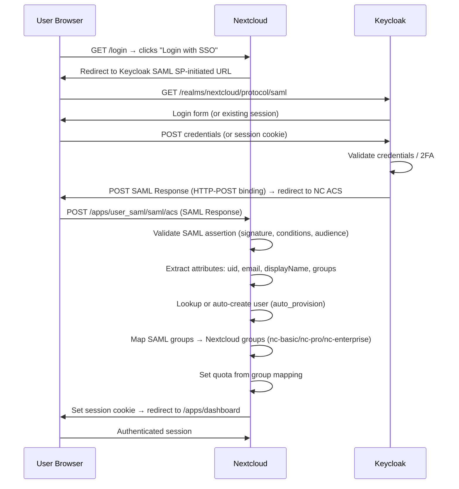
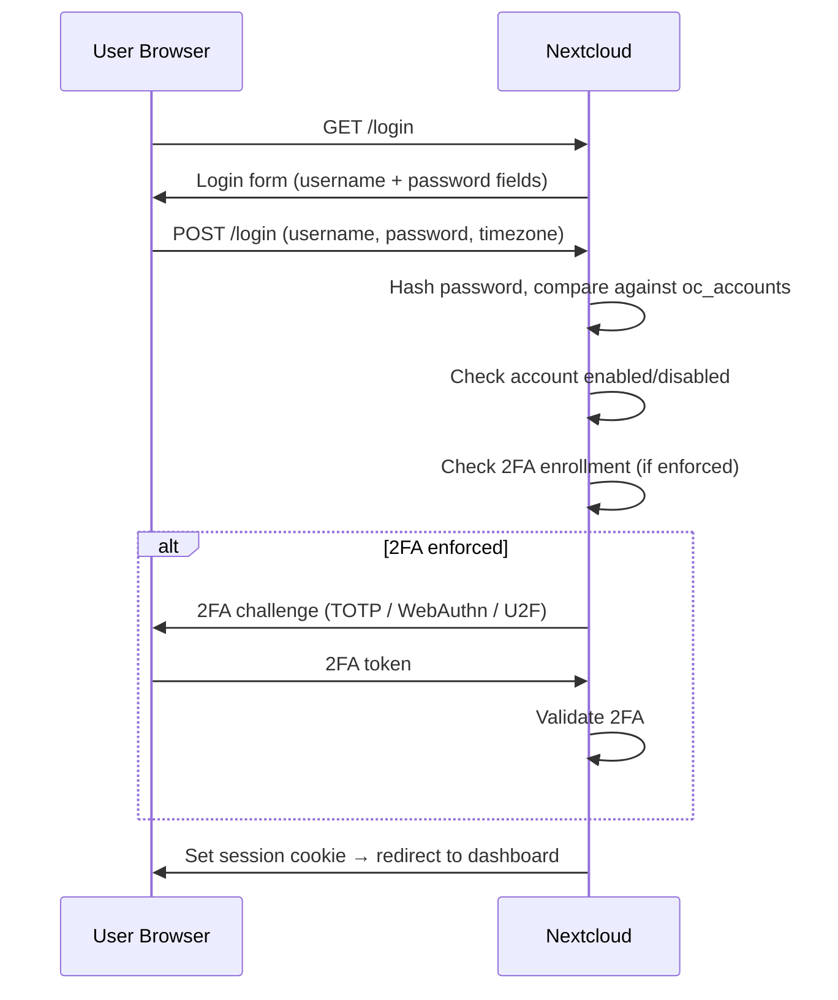
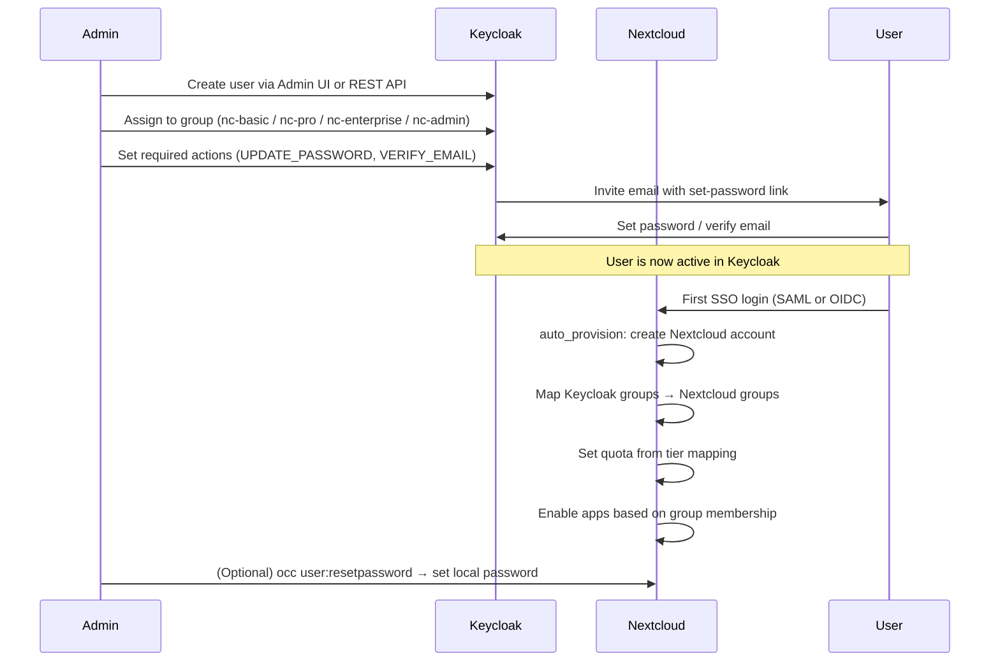
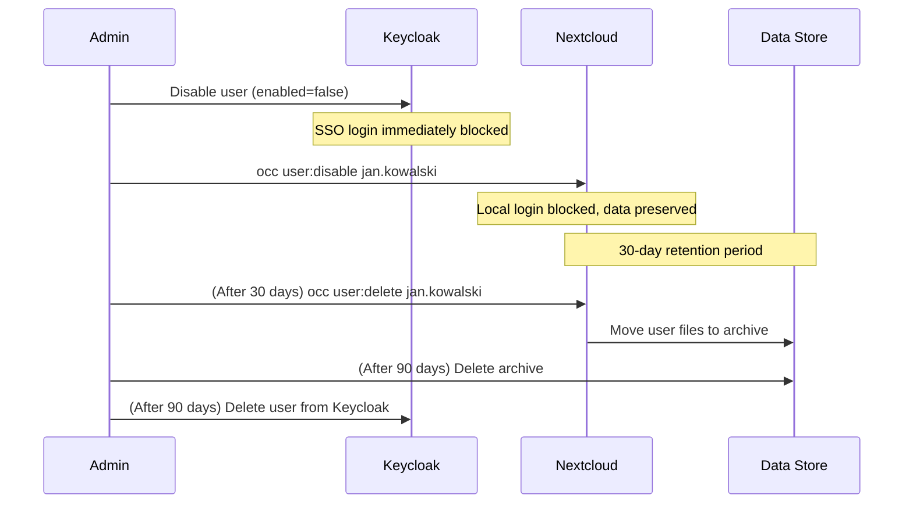

# Multi-Tenant Identity Architecture for Nextcloud — 50 Users, Dual Authentication

**Document:** `docs/identity-architecture.md`
**Repository:** ScuraUrsa/nextcloud-deployment
**Date:** 2026-06-14
**Author:** Filip Kaźmierczak & Hermes Orchestrator

---

## 1. IDENTITY PROVIDER EVALUATION

Five open-source IdPs evaluated for the 50-user Nextcloud deployment. Criteria: protocol support, user federation, admin UI quality, resource footprint, community size, and Nextcloud integration maturity.

### 1.1 Candidate Profiles

#### Keycloak
- **Protocols:** SAML 2.0, OpenID Connect, OAuth 2.0, LDAP federation, Kerberos
- **User Federation:** LDAP/AD sync, identity brokering (chain multiple IdPs), social login, custom user storage SPI
- **Admin UI:** Rich web console (React), realm-based multi-tenancy, client/role/group management, session monitoring, event logging
- **Resource Footprint:** ~512 MB RAM (dev/test), 1–2 GB (small production). Java/Quarkus runtime. PostgreSQL recommended.
- **Community:** 12k+ GitHub stars, Red Hat sponsored, CNCF incubation-level maturity, massive ecosystem
- **Nextcloud Integration:** First-class. Both `user_saml` (SAML) and `user_oidc` (OIDC) apps have documented Keycloak setups. SAML metadata import/export works bidirectionally. Group claim mapping supported.
- **Distinguishing Features:** User federation SPI for custom backends, fine-grained authorization policies, token exchange, CIBA (Client Initiated Backchannel Authentication)

#### Authentik
- **Protocols:** SAML 2.0, OpenID Connect, OAuth 2.0, LDAP, Proxy authentication, SCIM (beta)
- **User Federation:** LDAP/AD sync, social login, custom sources via flows
- **Admin UI:** Modern Django-based web UI with visual flow/policy builder. Drag-and-drop authentication flows. Expression-based policies.
- **Resource Footprint:** ~256 MB idle, ~1 GB under load (server + worker + PostgreSQL). Python/Django backend.
- **Community:** 15k+ GitHub stars, very active self-hosting community, rapid release cadence
- **Nextcloud Integration:** Well-documented. Community guides for both SAML and OIDC. The flow builder makes it easy to add 2FA enrollment steps before Nextcloud login.
- **Distinguishing Features:** Visual flow/policy builder (unique), built-in reverse proxy auth, expression policies, application-level access control

#### Gluu (Gluu Server 4.x)
- **Protocols:** SAML 2.0, OpenID Connect, OAuth 2.0, UMA 2.0, SCIM
- **User Federation:** LDAP/AD, custom authentication scripts (interception scripts in Python/JS), social login
- **Admin UI:** oxTrust web UI (Java-based), TUI (text-based UI) for initial setup. Functional but less polished than Keycloak/Authentik.
- **Resource Footprint:** ~1 GB RAM minimum, 2 GB+ recommended. Java-based (Jetty/WildFly). LDAP backend (OpenDJ/OpenLDAP).
- **Community:** Smaller community (~1k GitHub stars). Commercial support from Gluu Inc. More enterprise-focused.
- **Nextcloud Integration:** Works via standard SAML/OIDC. Less community documentation specific to Nextcloud. UMA support is unique but not needed for this deployment.
- **Distinguishing Features:** UMA 2.0 (User-Managed Access), interception scripts for custom auth logic, FIDO2 support

#### LemonLDAP::NG
- **Protocols:** SAML 2.0, OpenID Connect, CAS, OAuth 2.0, LDAP, Kerberos, SSL client certs
- **User Federation:** LDAP/AD, database (MySQL/PostgreSQL), social networks, custom Perl modules
- **Admin UI:** Web-based manager (Perl CGI). Functional but dated. Configuration stored in files or database. Rule-based access control with Perl expressions.
- **Resource Footprint:** ~128 MB RAM. Perl/FastCGI runtime. Very lightweight. Nginx/Apache integration via handler modules.
- **Community:** Niche (~500 GitHub stars). Strong in French academic/government sectors. Linagora provides commercial support.
- **Nextcloud Integration:** Works via standard SAML/OIDC. No Nextcloud-specific documentation. Handler-based architecture means it sits in front of Nextcloud as a reverse proxy — different deployment model.
- **Distinguishing Features:** Handler/reverse-proxy architecture (protects apps without native SSO support), CAS protocol, extremely lightweight, rule-based authorization with Perl expressions

#### SimpleSAMLphp
- **Protocols:** SAML 2.0 (primary), OpenID Connect (via module), CAS (via module), OAuth (via module)
- **User Federation:** LDAP, SQL database, custom auth sources via PHP modules
- **Admin UI:** Web-based configuration interface. Functional but basic. Configuration stored in PHP arrays and flat files.
- **Resource Footprint:** ~64 MB RAM. PHP runtime. Extremely lightweight. Can run alongside Nextcloud on the same PHP-FPM pool.
- **Community:** Mature (~1k GitHub stars), widely used in academic/research sector (eduGAIN, SURFconext). Slow release cadence.
- **Nextcloud Integration:** Works via SAML. The `user_saml` app is built on a PHP SAML library that interoperates with SimpleSAMLphp. Can act as IdP or SP.
- **Distinguishing Features:** Lightest weight option, PHP-native (same stack as Nextcloud), strong academic federation support, can be embedded

### 1.2 Scored Comparison Table

| Criterion (weight) | Keycloak | Authentik | Gluu | LemonLDAP::NG | SimpleSAMLphp |
|---|---|---|---|---|---|
| **Protocol Coverage** (15%) | 10/10 | 9/10 | 9/10 | 9/10 | 5/10 |
| **User Federation** (15%) | 10/10 | 8/10 | 8/10 | 7/10 | 5/10 |
| **Admin UI Quality** (15%) | 9/10 | 10/10 | 6/10 | 5/10 | 4/10 |
| **Resource Footprint** (10%) | 6/10 | 7/10 | 4/10 | 9/10 | 10/10 |
| **Community & Ecosystem** (15%) | 10/10 | 8/10 | 4/10 | 3/10 | 5/10 |
| **Nextcloud Integration** (20%) | 10/10 | 9/10 | 6/10 | 5/10 | 6/10 |
| **Operational Maturity** (10%) | 9/10 | 7/10 | 7/10 | 6/10 | 6/10 |
| **WEIGHTED TOTAL** | **9.25** | **8.35** | **6.35** | **5.95** | **5.65** |

### 1.3 Recommendation: Keycloak (Primary)

**Keycloak is recommended as the primary IdP** for the following reasons:

1. **Nextcloud integration maturity** — Both `user_saml` and `user_oidc` apps have first-class Keycloak documentation. SAML metadata exchange is bidirectional and well-tested.
2. **Protocol coverage** — SAML 2.0 and OIDC both fully supported, giving flexibility in Nextcloud auth app choice.
3. **User federation** — LDAP federation and custom user storage SPI allow future expansion to enterprise directories.
4. **Operational maturity** — Red Hat sponsored, CNCF ecosystem, extensive documentation, Ansible collections available.
5. **Group claim mapping** — Keycloak can emit group memberships as SAML attributes or OIDC claims, which Nextcloud can map to internal groups for tiered access control.
6. **REST API** — Full admin REST API for automated user/group provisioning from Ansible playbooks.

**Authentik is the recommended fallback** if the visual flow builder or lighter resource footprint is preferred. Its policy/flow system is more intuitive for smaller teams.

---

## 2. DUAL AUTHENTICATION FLOW

Nextcloud supports multiple user backends simultaneously. The deployment uses two paths that coexist:

- **Path A (SSO):** SAML 2.0 via `user_saml` app OR OpenID Connect via `user_oidc` app → Keycloak
- **Path B (Local):** Native Nextcloud username/password against `oc_accounts` table

### 2.1 Critical Configuration

```php
// config.php — enable multiple backends
'allow_multiple_backends' => true,

// user_saml app settings
'saml_allow_multiple_backends' => true,
'saml_auto_provision' => true,
```

Without `allow_multiple_backends = true`, enabling SAML/OIDC would lock out local admin accounts. This is the single most important setting.

### 2.2 Sequence Diagrams

#### Path A: SSO Login (SAML)



#### Path A: SSO Login (OIDC — alternative)

```mermaid
sequenceDiagram
    participant U as User Browser
    participant NC as Nextcloud
    participant KC as Keycloak

    U->>NC: GET /login → clicks "Login with OpenID"
    NC->>U: Redirect to Keycloak OIDC authorize endpoint
    U->>KC: GET /realms/nextcloud/protocol/openid-connect/auth
    KC->>U: Login form
    U->>KC: POST credentials
    KC->>KC: Validate + 2FA
    KC->>U: Redirect to NC with authorization code
    U->>NC: GET /apps/user_oidc/code?code=...&state=...
    NC->>KC: POST /token (backchannel: code → tokens)
    KC->>NC: id_token + access_token + refresh_token
    NC->>NC: Validate id_token (signature, iss, aud, exp)
    NC->>NC: Extract claims: sub, email, name, groups
    NC->>NC: Lookup or auto-create user
    NC->>NC: Map OIDC group claims → Nextcloud groups
    NC->>U: Set session cookie → redirect to dashboard
```



#### Path B: Local Login



### 2.3 Coexistence Rules

1. **SSO user can also set a local password.** An SSO-provisioned user can use `occ user:resetpassword` to set a local password, enabling Path B as fallback if Keycloak is unreachable.
2. **Local user can be linked to SSO later.** If a user exists locally and later authenticates via SSO with the same email/uid, Nextcloud links the accounts (attribute matching). The `user_saml` app's `auto_provision` setting controls whether new accounts are created or existing ones matched.
3. **Login page shows both options.** With multiple backends enabled, Nextcloud's login page shows the standard username/password form plus an "SSO Login" button (or multiple buttons if both SAML and OIDC are configured).
4. **Password policy exemption for SSO users.** The `password_policy` app must be configured to not enforce password rules on SSO-only users (they have no local password). Known issue: password_policy v26+ can block SAML login if not configured correctly.
5. **Admin emergency access.** At least one admin account must have a local password (not SSO-only) to ensure access when Keycloak is down.

### 2.4 Session Management

- Nextcloud sessions are server-side (PHP session, stored in Redis).
- Keycloak sessions are independent (Keycloak cookies).
- Single Logout (SLO): SAML SLO is supported — Nextcloud can initiate SLO to Keycloak, and Keycloak can propagate to other SPs.
- Session timeout: Configured separately in Nextcloud (`session_lifetime`) and Keycloak (realm token/session settings).

---

## 3. USER PROVISIONING & DEPROVISIONING PIPELINE

### 3.1 Provisioning Flow



#### Step-by-step provisioning commands

**Keycloak — Create user via REST API:**
```bash
# Get admin token
ADMIN_TOKEN=$(curl -s -X POST \
  "https://auth.example.com/realms/master/protocol/openid-connect/token" \
  -d "client_id=admin-cli" \
  -d "username=admin" \
  -d "password=$KEYCLOAK_ADMIN_PASS" \
  -d "grant_type=password" | jq -r '.access_token')

# Create user
curl -X POST \
  "https://auth.example.com/admin/realms/nextcloud/users" \
  -H "Authorization: Bearer $ADMIN_TOKEN" \
  -H "Content-Type: application/json" \
  -d '{
    "username": "jan.kowalski",
    "email": "jan.kowalski@example.com",
    "firstName": "Jan",
    "lastName": "Kowalski",
    "enabled": true,
    "requiredActions": ["UPDATE_PASSWORD", "VERIFY_EMAIL"],
    "groups": ["nc-basic"]
  }'

# Or add to group after creation
USER_ID=$(curl -s "https://auth.example.com/admin/realms/nextcloud/users?username=jan.kowalski" \
  -H "Authorization: Bearer $ADMIN_TOKEN" | jq -r '.[0].id')

GROUP_ID=$(curl -s "https://auth.example.com/admin/realms/nextcloud/groups?search=nc-basic" \
  -H "Authorization: Bearer $ADMIN_TOKEN" | jq -r '.[0].id')

curl -X PUT \
  "https://auth.example.com/admin/realms/nextcloud/users/$USER_ID/groups/$GROUP_ID" \
  -H "Authorization: Bearer $ADMIN_TOKEN"
```

**Nextcloud — Set local password and quota (post auto-provision):**
```bash
# Set local password for SSO user (enables Path B fallback)
sudo -u www-data php /var/www/nextcloud/occ user:resetpassword jan.kowalski

# Set explicit quota (overrides group default)
sudo -u www-data php /var/www/nextcloud/occ user:setting jan.kowalski files quota "10 GB"

# Add to Nextcloud group (if not auto-mapped)
sudo -u www-data php /var/www/nextcloud/occ group:adduser nc-basic jan.kowalski
```

### 3.2 Deprovisioning Flow



#### Deprovisioning commands:
```bash
# Step 1: Disable in Keycloak
curl -X PUT \
  "https://auth.example.com/admin/realms/nextcloud/users/$USER_ID" \
  -H "Authorization: Bearer $ADMIN_TOKEN" \
  -H "Content-Type: application/json" \
  -d '{"enabled": false}'

# Step 2: Disable in Nextcloud (preserves data)
sudo -u www-data php /var/www/nextcloud/occ user:disable jan.kowalski

# Step 3: After 30 days — delete user, archive data
sudo -u www-data php /var/www/nextcloud/occ user:delete jan.kowalski
# Manual: mv /data/nextcloud/jan.kowalski /archive/users/jan.kowalski-$(date +%Y%m%d)

# Step 4: After 90 days — purge archive
# rm -rf /archive/users/jan.kowalski-*

# Step 5: Delete from Keycloak
curl -X DELETE \
  "https://auth.example.com/admin/realms/nextcloud/users/$USER_ID" \
  -H "Authorization: Bearer $ADMIN_TOKEN"
```

### 3.3 Bulk Operations

**Ansible playbook from CSV:**
The repository includes `users.csv.example` and a `nextcloud_user_management.yml` playbook. The CSV format:

```csv
username,email,displayname,tier,quota_gb,password_reset
jan.kowalski,jan.kowalski@example.com,Jan Kowalski,basic,10,true
```

The playbook loops over CSV rows and:
1. Creates user in Keycloak via REST API
2. Assigns to Keycloak group based on tier
3. Optionally pre-creates Nextcloud account via `occ user:add`
4. Sets quota via `occ user:setting`

**Keycloak bulk import:**
Keycloak supports JSON import of users at realm creation or via partial import:
```bash
# Partial import of users
curl -X POST \
  "https://auth.example.com/admin/realms/nextcloud/partialImport" \
  -H "Authorization: Bearer $ADMIN_TOKEN" \
  -H "Content-Type: application/json" \
  -d '{
    "users": [
      {"username": "jan.kowalski", "email": "jan.kowalski@example.com", ...},
      ...
    ]
  }'
```

**Nextcloud occ scripting:**
```bash
# Bulk create from CSV using bash loop
while IFS=, read -r username email displayname tier quota_gb reset; do
  [[ $username == "username" ]] && continue  # skip header
  sudo -u www-data php /var/www/nextcloud/occ user:add "$username" --display-name="$displayname" --email="$email"
  sudo -u www-data php /var/www/nextcloud/occ group:adduser "nc-$tier" "$username"
  sudo -u www-data php /var/www/nextcloud/occ user:setting "$username" files quota "$quota_gb GB"
done < users.csv
```

---

## 4. GROUP-TO-FEATURE MAPPING FOR TIERED ACCESS

### 4.1 Tier Definitions

| Tier | Nextcloud Group | Monthly Price | Storage Quota | Target Users |
|---|---|---|---|---|
| **Basic** | `nc-basic` | 20 PLN | 10 GB | Individuals, light use |
| **Pro** | `nc-pro` | 50 PLN | 50 GB | Professionals, small teams |
| **Enterprise** | `nc-enterprise` | 120 PLN | 250 GB | Organizations, power users |
| **Admin** | `nc-admin` | N/A | Unlimited | System administrators |

### 4.2 Feature Matrix by Tier

| Feature | Basic | Pro | Enterprise | Admin |
|---|---|---|---|---|
| **Files** (WebDAV, sharing, versioning) | Full | Full | Full | Full |
| **Activity feed** | Full | Full | Full | Full |
| **Notifications** | Full | Full | Full | Full |
| **Calendar** | Read-only | Full (create/edit/share) | Full | Full |
| **Contacts** | Read-only | Full (create/edit/share) | Full | Full |
| **2FA — TOTP** | Enforced | Enforced | Enforced | Enforced |
| **2FA — WebAuthn/FIDO2** | — | Optional | Enforced | Enforced |
| **Talk** | — | 10 participants/call | Unlimited participants | Unlimited |
| **Deck** (Kanban) | — | Full | Full | Full |
| **Notes** (Markdown) | — | Full | Full | Full |
| **Mail** (IMAP/SMTP) | — | 3 accounts | Unlimited accounts | Unlimited |
| **Forms** (surveys) | — | Full | Full | Full |
| **Polls** | — | Full | Full | Full |
| **Collabora Online** (office) | — | — | Full | Full |
| **ONLYOFFICE** (alternative) | — | — | Full | Full |
| **Photos + Recognize** (AI tagging) | — | — | Full | Full |
| **Music** (audio player) | — | — | Full | Full |
| **News** (RSS reader) | — | — | Full | Full |
| **Bookmarks** | — | — | Full | Full |
| **Maps** (geolocation) | — | — | Full | Full |
| **Social** (federated microblog) | — | — | Full | Full |
| **External Storage** (S3, SFTP, etc.) | — | — | Full | Full |
| **Server-side Encryption** | — | — | Full | Full |
| **Full-text Search** (Elasticsearch) | — | — | Full | Full |
| **LDAP/AD integration** | — | — | Full | Full |
| **File ACLs** (per-file rules) | — | — | Full | Full |
| **Retention** (auto-delete policies) | — | — | Full | Full |
| **Impersonate** (login-as-user) | — | — | — | Full |
| **Server Info** (system stats) | — | — | — | Full |

### 4.3 Implementation Mechanism

Nextcloud's app visibility can be restricted by group. In the Apps management page (admin settings), each app has a "Limit to groups" checkbox. When checked, only members of the selected groups see the app in their UI and can use it.

**occ commands for group-based app restriction:**
```bash
# Enable app and restrict to specific groups
sudo -u www-data php /var/www/nextcloud/occ app:enable calendar
sudo -u www-data php /var/www/nextcloud/occ group:adduser nc-pro calendar_users
# Then in admin UI: limit Calendar app to groups "nc-pro, nc-enterprise, nc-admin"

# For read-only Calendar on Basic tier:
# Enable Calendar app for all, but use internal permissions
# (Nextcloud doesn't natively support read-only Calendar per-group;
#  this requires a custom approach — see Section 5)
```

**Keycloak group attribute mapping to Nextcloud:**
In Keycloak, configure a SAML client mapper or OIDC group claim mapper that sends group memberships as an attribute. The `user_saml` app maps this attribute to Nextcloud groups:

```php
// config.php — SAML group mapping
'saml_group_mapping' => [
    'nc-basic' => 'nc-basic',
    'nc-pro' => 'nc-pro',
    'nc-enterprise' => 'nc-enterprise',
    'nc-admin' => 'nc-admin',
],
```

### 4.4 Quota Enforcement

Quotas are set per-user via `occ user:setting` or the admin UI. The provisioning pipeline sets quota based on tier:

| Tier | Quota |
|---|---|
| nc-basic | 10 GB |
| nc-pro | 50 GB |
| nc-enterprise | 250 GB |
| nc-admin | Unlimited ("none") |

---

## 5. FEATURE SEPARABILITY MATRIX

Not all Nextcloud features can be cleanly gated per-user or per-group. This matrix classifies every feature by its separability characteristics.

### 5.1 FULLY SEPARABLE (Per-User)

These features can be enabled/disabled or configured independently for each user without affecting others.

| Feature | Mechanism | Notes |
|---|---|---|
| **Storage quota** | `occ user:setting <user> files quota "<N> GB"` | Per-user, immediate effect |
| **App visibility** | Group restriction in App settings | User only sees apps their groups are allowed |
| **Talk participant limits** | Per-user setting (if custom signaling) | Default: global. Custom: per-user via HPB config |
| **Mail accounts** | User-level IMAP/SMTP config | Each user configures their own mail accounts |
| **Calendar access** | Calendar app permissions | Per-calendar share permissions (read/write/admin) |
| **Contacts access** | Contacts app permissions | Per-addressbook share permissions |
| **Deck boards** | Board-level share permissions | Per-board access control |
| **Notes** | Per-note share permissions | Individual note sharing |
| **External Storage mounts** | `occ files_external:create` per-user | Personal mounts visible only to that user |
| **2FA enforcement** | `occ twofactorauth:enforce <user>` | Per-user 2FA mandate |
| **File retention tags** | Files retention app | Per-tag, per-folder retention rules |
| **File ACLs** | Files access control app | Per-file, per-user, per-group rules |
| **Password policy** | Per-group exemption possible | SSO users exempted from password rules |

### 5.2 PARTIALLY SEPARABLE (Per-Group, Shared Infrastructure)

These features are enabled at the group level but share backend infrastructure. All users in the group use the same service instance.

| Feature | Shared Component | Constraint |
|---|---|---|
| **Collabora Online** | Shared CODE (Collabora Online Development Edition) server | One CODE instance serves all authorized users. License: limited to 20 concurrent documents / 10 concurrent users in free edition. Enterprise tier users share the same server. |
| **ONLYOFFICE** | Shared Document Server | One Docs server instance. All Enterprise users share it. |
| **Full-text Search** | Shared Elasticsearch cluster | One index for the entire Nextcloud instance. All Enterprise users' files indexed together. Search results scoped by user permissions at query time. |
| **Photos + Recognize** | Shared GPU/CPU for ML inference | One Recognize service processes all Enterprise users' photos. Face clustering and object tagging are global but results are per-user. |
| **Talk TURN/STUN** | Shared coturn server | One TURN server for all Talk users. Bandwidth shared. Pro users limited to 10 participants via app config; Enterprise unlimited. |
| **Antivirus** | Shared ClamAV daemon | One ClamAV instance scans all uploads. Enabled for Enterprise tier only but scans happen at the filesystem level. |
| **LDAP/AD** | Shared LDAP connection | One LDAP backend configuration. Enterprise users can authenticate via LDAP; others cannot. |
| **External Storage (global)** | Shared S3/MinIO bucket | Global external storage mounts visible to all authorized groups. |

### 5.3 GLOBALLY COUPLED (Instance-Wide)

These features are either on or off for the entire Nextcloud instance. They cannot be scoped to individual users or groups.

| Feature | Reason for Global Coupling |
|---|---|
| **Server-side Encryption** | The "Default encryption module" encrypts all files at the storage layer. Once enabled, it affects all users' files. Cannot be per-user. (End-to-end encryption is per-folder, client-side, and IS separable.) |
| **Federation** | Federated sharing (Nextcloud-to-Nextcloud) is an instance-level protocol. Either the instance participates in the federation or it doesn't. |
| **Theming/Branding** | Theming applies to the entire instance (logo, colors, name). Cannot be per-user or per-group. |
| **Brute-force protection** | Global rate-limiting on login attempts. Applies to all authentication endpoints. |
| **Password policy** | Global password rules (length, complexity, expiration). Can exempt SSO users but rules themselves are instance-wide. |
| **Suspicious login detection** | Global ML model analyzing all login patterns. Instance-wide threat detection. |
| **Ransomware protection** | Global pattern detection on file operations. Instance-wide. |
| **Backup/Restore** | Instance-level operation. Backs up all user data together. |
| **Monitoring** | Prometheus/Grafana monitor the entire instance. Metrics are per-user in dashboards but the monitoring stack is global. |
| **TLS/SSL configuration** | Web server TLS settings apply to all connections. |
| **CORS/CSP headers** | Security headers are web-server-level, applying to all responses. |
| **Redis session store** | All user sessions stored in the same Redis instance. |
| **Database** | Single PostgreSQL database for all users. |
| **PHP-FPM pool** | Shared PHP worker pool for all requests. |

### 5.4 Separability Implementation Notes

**For "Fully Separable" features:**
- Use `occ` commands in provisioning scripts to set per-user values.
- Use Nextcloud's group-based app restriction for UI-level gating.
- The test suite (`tests/test_tiers/`) validates that Basic users cannot access Pro/Enterprise apps.

**For "Partially Separable" features:**
- Deploy shared backend services (CODE, Elasticsearch, coturn, ClamAV) once.
- Gate access at the Nextcloud app level (group restriction).
- Accept that all authorized users share the same backend instance.
- Monitor shared resource usage; scale backend if Enterprise tier grows.

**For "Globally Coupled" features:**
- Document these as instance-wide decisions in the deployment playbook.
- Server-side encryption: decide at deploy time. If enabled, all users are encrypted.
- Theming: configure once for the organization.
- Security features (brute-force, suspicious login, ransomware): always enable for all.

### 5.5 Read-Only Calendar/Contacts for Basic Tier — Implementation

The Basic tier specifies "read-only" Calendar and Contacts. Nextcloud does not natively support read-only app access per group. Two approaches:

1. **App disabled, WebDAV access only:** Disable the Calendar/Contacts apps for `nc-basic` group. Users can still access their calendars/contacts via CalDAV/CardDAV clients (read-only if share permissions are set to read).
2. **Custom app modification:** Fork the Calendar/Contacts apps to add a read-only mode gated by group membership. This is complex and fragile across updates.
3. **Recommended approach:** Enable Calendar/Contacts for Basic tier with full access but smaller quotas. The "read-only" distinction is primarily a marketing/positioning differentiator. For a 50-user deployment, the administrative overhead of enforcing true read-only is disproportionate to the benefit.

---

## APPENDIX A: Keycloak Realm Configuration Summary

```
Realm: nextcloud
Clients:
  - nextcloud-saml (SAML 2.0, client protocol: saml)
    - Root URL: https://cloud.example.com
    - Valid Redirect URIs: https://cloud.example.com/apps/user_saml/saml/acs
    - Master SAML Processing URL: https://cloud.example.com/apps/user_saml/saml/metadata
    - Sign documents: ON
    - Sign assertions: ON
    - Encrypt assertions: OFF (optional)
    - Client mappers: uid, email, cn, groups
  - nextcloud-oidc (OpenID Connect, client protocol: openid-connect)
    - Access Type: confidential
    - Valid Redirect URIs: https://cloud.example.com/apps/user_oidc/code
    - Client mappers: groups (group membership claim)

Groups:
  - nc-basic
  - nc-pro
  - nc-enterprise
  - nc-admin

Required actions for new users:
  - UPDATE_PASSWORD
  - VERIFY_EMAIL

Authentication flows:
  - Browser flow: Cookie → Kerberos (optional) → Password Form → OTP Form (conditional)
```

## APPENDIX B: Nextcloud config.php — Identity Section

```php
// Multi-backend authentication
'allow_multiple_backends' => true,

// SAML (user_saml app)
'saml_enabled' => true,
'saml_idp_entity_id' => 'https://auth.example.com/realms/nextcloud',
'saml_idp_sso_url' => 'https://auth.example.com/realms/nextcloud/protocol/saml',
'saml_idp_slo_url' => 'https://auth.example.com/realms/nextcloud/protocol/saml',
'saml_idp_x509cert' => 'MIIE...',
'saml_sp_entity_id' => 'https://cloud.example.com',
'saml_sp_acs_url' => 'https://cloud.example.com/apps/user_saml/saml/acs',
'saml_sp_slo_url' => 'https://cloud.example.com/apps/user_saml/saml/sls',
'saml_attr_mapping_uid' => 'uid',
'saml_attr_mapping_email' => 'email',
'saml_attr_mapping_displayname' => 'cn',
'saml_attr_mapping_groups' => 'groups',
'saml_group_mapping' => [
    'nc-basic' => 'nc-basic',
    'nc-pro' => 'nc-pro',
    'nc-enterprise' => 'nc-enterprise',
    'nc-admin' => 'nc-admin',
],
'saml_auto_provision' => true,
'saml_allow_multiple_backends' => true,

// OIDC (user_oidc app) — alternative or complementary
'oidc_login_provider_url' => 'https://auth.example.com/realms/nextcloud',
'oidc_login_client_id' => 'nextcloud-oidc',
'oidc_login_client_secret' => '...',
'oidc_login_auto_provision' => true,
'oidc_login_attributes' => [
    'id' => 'sub',
    'email' => 'email',
    'name' => 'name',
    'groups' => 'groups',
],
'oidc_login_group_mapping' => [
    'nc-basic' => 'nc-basic',
    'nc-pro' => 'nc-pro',
    'nc-enterprise' => 'nc-enterprise',
    'nc-admin' => 'nc-admin',
],

// Session
'session_lifetime' => 86400,  // 24 hours
'session_keepalive' => true,
```

## APPENDIX C: Emergency Recovery Procedures

### Keycloak is down — admin needs to access Nextcloud
```bash
# Admin with local password can still log in via Path B
# If no admin has local password, use occ to create one:
sudo -u www-data php /var/www/nextcloud/occ user:resetpassword admin
# Then log in at https://cloud.example.com/login with username/password
```

### Keycloak is down — users need to access Nextcloud
```bash
# Only users with local passwords set can log in
# Bulk-set local passwords for SSO users:
while IFS=, read -r username email displayname tier quota_gb reset; do
  [[ $username == "username" ]] && continue
  sudo -u www-data php /var/www/nextcloud/occ user:resetpassword "$username"
done < users.csv
# Users will receive password-reset emails and can set local passwords
```

### SAML configuration broken — revert to local-only
```bash
# Disable SAML temporarily
sudo -u www-data php /var/www/nextcloud/occ app:disable user_saml
# All users must use local passwords until SAML is fixed
```

---

## REFERENCES

1. Nextcloud SSO & SAML Authentication App: https://apps.nextcloud.com/apps/user_saml
2. Nextcloud OIDC Connect App: https://github.com/nextcloud/user_oidc
3. Keycloak Documentation: https://www.keycloak.org/documentation
4. Keycloak Admin REST API: https://www.keycloak.org/docs-api/latest/rest-api/index.html
5. Authentik Documentation: https://goauthentik.io/docs/
6. Gluu Server 4.0 Docs: https://docs-4.gluu.org/
7. LemonLDAP::NG: https://lemonldap-ng.org/
8. SimpleSAMLphp: https://simplesamlphp.org/
9. Nextcloud occ command: https://docs.nextcloud.com/server/stable/admin_manual/occ_command.html
10. Nextcloud multiple user backends: https://portal.nextcloud.com/article/Authentication/Using-multiple-user-backends
11. Open-source SSO comparison: https://gist.github.com/bmaupin/6878fae9abcb63ef43f8ac9b9de8fafd
12. Keycloak vs Authentik comparison: https://ossalt.com/guides/keycloak-vs-authentik-2026
