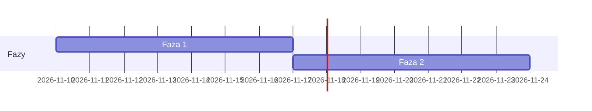

# Projekt: {nazwa}

> [!info] Cel: · Termin: · Tablica Deck: (wstaw przez /)

## Po co

## Kryteria „gotowe”

- [ ] 

## Fazy

```mermaid
gantt
    dateFormat YYYY-MM-DD
    section Fazy
    Faza 1 :a1, 2026-11-10, 7d
    Faza 2 :after a1, 7d
```

## Ryzyka

## Dziennik
